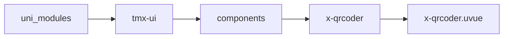
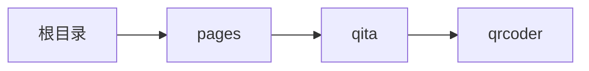

# 二维码 xQrcoder
-------
<ViewMobile url="/pages/qita/qrcoder" />

## 介绍

本组件使用UTS原生代码绘制，性能非常高，如果你是在1.1.9之前版本请使用x-qrcoder-s原生插件获得高性能。从1.1.9版本后请
使用组件绘制QR码来获得更高性能和更多样式配置。

## 平台兼容

| Harmony | H5 | andriod | IOS | 小程序 | UTS | UNIAPP-X SDK | version |
| --- | --- | --- | --- | --- | --- | --- | --- |
| ☑ | ☑ | ☑️ | ☑️ | ☑️ | ☑️ | 4.76+ | 1.1.18 |


## 文件路径

``` ts

@/uni_modules/tmx-ui/components/x-qrcoder/x-qrcoder.uvue
```



## 使用

``` ts

<x-qrcoder></x-qrcoder>
```

## Props 属性

| 名称 | 说明 | 类型 | 默认值 |
| ------ | ---- | ---- | ---- |
| width | `窗口宽`<br> | `string` | `'250px'` |
| height | `窗口高`<br> | `string` | `'250px'` |
| color | `码颜色`<br> | `string` | `"primary"` |
| bgColor | `码背景颜色`<br> | `string` | `"white"` |
| posColor | `码的定位点颜色，不填写和前景一致`<br> | `string` | `""` |
| text | `条码内容`<br> | `string` | `"https://xui.tmui.design"` |
| logo | `是否绘制Logo到qr上`<br> | `string` | `""` |
| logoBgColor | `Logo背景色`<br> | `string` | `"#fff"` |
| logoSize | `logo大小`<br> | `string` | `"50px"` |
| padding | `边距`<br> | `number` | `2` |
| mode | `绘制样式：rect/circular/line/rectSmall/xing/vertical`<br> | `string` | `"rect"` |
| pdRounded | `定位位点是否使用圆角`<br> | `boolean` | `false` |
| wifi | `生成wifi码`<br> | `UTSJSONObject` | `() : UTSJSONObject => ({} as UTSJSONObject)` |


## Events 事件

| 名称 | 参数 | 说明 |
| ------ | ---- | ---- |


## Slots 插槽

| 名称 | 说明 | 数据 |
| ------ | ---- | ---- |


## Ref 方法

| 名称 | 参数 | 返回值 | 说明 |
| ------ | ---- | ---- | ---- |
| getQrImg | - | `-` | 返回二维码图片路径 * |


## 示例文件路径

``` json

/pages/qita/qrcoder
```



## 示例源码

::: details uvue

<<< ../../../../pages/qita/qrcoder.uvue{vue}

:::

