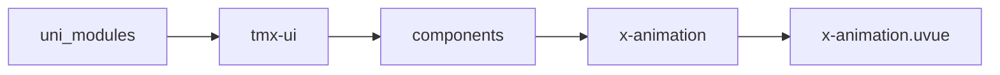
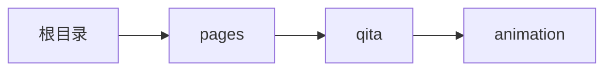

# 动画 xAnimation
-------
<ViewMobile url="/pages/qita/animation" />

## 介绍

动画组件

## 平台兼容

| Harmony | H5 | andriod | IOS | 小程序 | UTS | UNIAPP-X SDK | version |
| --- | --- | --- | --- | --- | --- | --- | --- |
| ☑ | ☑ | ☑️ | ☑️ | ☑️ | ☑️ | 4.81+ | 1.1.20 |


## 文件路径

``` ts

@/uni_modules/tmx-ui/components/x-animation/x-animation.uvue
```



## 使用

``` ts

<x-animation></x-animation>
```

## Props 属性

| 名称 | 说明 | 类型 | 默认值 |
| ------ | ---- | ---- | ---- |
| autoPlay | `是否自动播放`<br> | `boolean` | `false` |
| duration | `动画播放的时间+50+5`<br> | `number` | `350` |
| delay | `当自动播放时，延迟自动播放的时间`<br> | `number` | `0` |
| name | `动画名称`<br> | `string` | `'fadeIn'` |
| ease | `缓动动画名称`<br> | `string` | `'tmxEase'` |
| control | `自动监测是否播放。如果标志为play就开始播放动画，但`<br>`如果动画在播放中这个值不会有任何响应，而且需要v-model:playing用法来双向绑定读取此属性`<br>`你可以通过播放事件来确定修改此值。`<br>` 'play' \`<br>` 'default'`<br> | `string` | `'default'` |
| status | `播放状态，只能用来读取此值，不可更改，使用时请v-model:status来读取动态的状态值`<br> | `xAnimationStatusType` | `'complete'` |


## Events 事件

| 名称 | 参数 | 说明 |
| ------ | ---- | ---- |
| beforePlay | `-` | 播放前执行 |
| complete | `-` | 播放完成执行 |
| play | `-` | 播放时触发 |
| update:control | `-` | 同步控制播放参数<br>等同v-model:control |
| update:status | `-` | 当前播放的状态<br>等同vmodel:status<br>它是单向输出的 |


## Slots 插槽

| 名称 | 说明 | 数据 |
| ------ | ---- | ---- |
| default | `默认插槽,下面的数据微信没有` | status: object<br> |


## Ref 方法

| 名称 | 参数 | 返回值 | 说明 |
| ------ | ---- | ---- | ---- |
| play | - | `-` | 播放动画 |


## 示例文件路径

``` json

/pages/qita/animation
```



## 示例源码

::: details uvue

<<< ../../../../pages/qita/animation.uvue{vue}

:::

