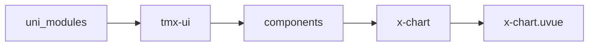
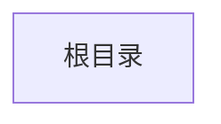

# 原生图表 Chart
-------
<ViewMobile url="" />

## 介绍

全新的原生图表支持所有平台，暗黑适配，更美观，渲染速度快，非webview，纯原生canvas实现。

## 平台兼容

| Harmony | H5 | andriod | IOS | 小程序 | UTS | UNIAPP-X SDK | version |
| --- | --- | --- | --- | --- | --- | --- | --- |
| ☑ | ☑ | ☑️ | ☑️ | ☑️ | ☑️ | 4.87+ | 1.1.22 |


## 文件路径

``` ts

@/uni_modules/tmx-ui/components/x-chart/x-chart.uvue
```



## 使用

``` ts

<x-chart></x-chart>
```

## Props 属性

| 名称 | 说明 | 类型 | 默认值 |
| ------ | ---- | ---- | ---- |
| width | ``<br> | `string` | `'100%'` |
| height | ``<br> | `string` | `'280px'` |
| options | ``<br> | `union` | `null` |
| preventScroll | `是否禁止页面滚动（拦截触摸事件），默认 true。设为 false 则允许页面滚动`<br> | `boolean` | `false` |
| interactive | `是否启用交互（点击高亮、提示框），默认 true。设为 false 则纯展示`<br> | `boolean` | `true` |


## Events 事件

| 名称 | 参数 | 说明 |
| ------ | ---- | ---- |
| click | `-` | - |
| reachEdge | `-` | - |


## Slots 插槽

| 名称 | 说明 | 数据 |
| ------ | ---- | ---- |


## Ref 方法

| 名称 | 参数 | 返回值 | 说明 |
| ------ | ---- | ---- | ---- |
| setOptions | - | `-` | - |
| redraw | - | `-` | - |


## 示例文件路径

``` json


```



## 示例源码

::: details uvue


:::

