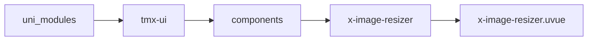
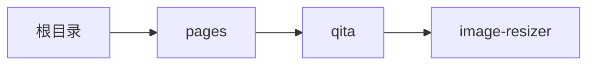

# 图片裁剪 xImageResizer
-------
<ViewMobile url="/pages/qita/image-resizer" />

## 介绍

兼容PC操作，可双指缩放，单指平移，翻转，也可支持电脑端滚轮缩放，鼠标平移，裁剪框四角缩放，功能齐全，操作方便。
web端裁剪后返回的是Base64数据，其它端是文件连接。

## 平台兼容

| Harmony | H5 | andriod | IOS | 小程序 | UTS | UNIAPP-X SDK | version |
| --- | --- | --- | --- | --- | --- | --- | --- |
| ☑ | ☑ | ☑️ | ☑️ | ☑️ | ☑️ | 4.76+ | 1.1.18 |


## 文件路径

``` ts

@/uni_modules/tmx-ui/components/x-image-resizer/x-image-resizer.uvue
```



## 使用

``` ts

<x-image-resizer></x-image-resizer>
```

## Props 属性

| 名称 | 说明 | 类型 | 默认值 |
| ------ | ---- | ---- | ---- |
| cropWidth | `裁剪框宽，px单位，裁剪后的图片不是这个大小，而是按比例缩放`<br> | `number` | `300` |
| cropHeight | `裁剪框高，px单位，裁剪后的图片不是这个大小，而是按比例缩放`<br> | `number` | `300` |
| compress | `压缩质量0-1`<br> | `number` | `1` |
| src | `待裁剪的图片，任意地址，网络（web要注意跨域），本地地址，相对地址均可。`<br> | `string` | `''` |


## Events 事件

| 名称 | 参数 | 说明 |
| ------ | ---- | ---- |
| confirm | `filepath: string` | 确认时返回文件<br>ios,安卓返回的是缓存文件路径<br>web返回的是Bolb文件对象<br>微信返回的是base64图片数据 |
| cancel | `-` | 取消裁剪时触 |


## Slots 插槽

| 名称 | 说明 | 数据 |
| ------ | ---- | ---- |


## Ref 方法

| 名称 | 参数 | 返回值 | 说明 |
| ------ | ---- | ---- | ---- |


## 示例文件路径

``` json

/pages/qita/image-resizer
```



## 示例源码

::: details uvue

<<< ../../../../pages/qita/image-resizer.uvue{vue}

:::

