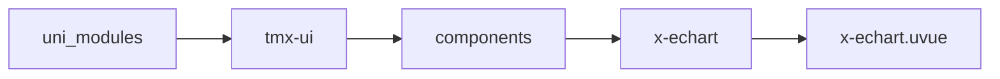
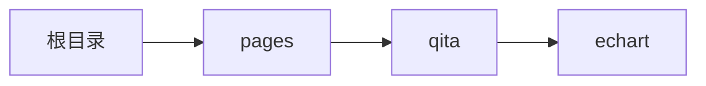

# 图表 xEchart
-------
<ViewMobile url="/pages/qita/echart" />

## 介绍

是百度图表6.0.0,全量版本
传递正常的百度对象数据且需要将数据JSON.stringify化
图表文档：https://echarts.apache.org/zh/index.html
编译微信版本：https://echarts.apache.org/zh/builder.html
微信版本请使用1.1.18下dmeo qita/echarts.esm.min.js文件。或者自己下载[Echart下载](https://github.com/apache/echarts/tree/6.0.0/dist)
注意的是：如果你的配置中函数函数，需要自己转换为字符串【如果是微信端建议直接传对象，不要转为字符串这样兼容性更好。】
比如：函数对象请参考我demo页面的示例规则分平台写否则无法实现函数对象。

## 平台兼容

| Harmony | H5 | andriod | IOS | 小程序 | UTS | UNIAPP-X SDK | version |
| --- | --- | --- | --- | --- | --- | --- | --- |
| ☑ | ☑ | ☑️ | ☑️ | ☑️ | ☑️ | 4.76+ | 1.1.18 |


## 文件路径

``` ts

@/uni_modules/tmx-ui/components/x-echart/x-echart.uvue
```



## 使用

``` ts

<x-echart></x-echart>
```

## Props 属性

| 名称 | 说明 | 类型 | 默认值 |
| ------ | ---- | ---- | ---- |
| width | `容器宽`<br> | `string` | `'auto'` |
| height | `容器高`<br> | `string` | `'250px'` |
| opts | `hbx sdk4.76+后建议不要使用此属性，请改用ref方法setOptions`<br> | `string` | `''` |


## Events 事件

| 名称 | 参数 | 说明 |
| ------ | ---- | ---- |
| init | `-` | 当图表初始化完成后触发，此时可以使用ref或者参数chart来来设置图表数据了。 |


## Slots 插槽

| 名称 | 说明 | 数据 |
| ------ | ---- | ---- |


## Ref 方法

| 名称 | 参数 | 返回值 | 说明 |
| ------ | ---- | ---- | ---- |
| setOptions | `data: union` <br>  - `小程序是object,非小程序是json序列化的字符串。` <br>  | `-` | 设置图表数据，小程序可以直接传图表对象数据。非小程序，需要序列化为字符串再赋值。 |
| getImg | - | `-` | 暂未开放 |
| setEcharts | `ins: Echart` <br>  - `微信专用函数。Echart实例` <br>  | `-` | 设置图表实例 |
| eventJsCall | - | `-` | - |
| cahrtActions | `funName: string` <br>  - `第一个参数是方法名如：resize` <br> `args: string` <br>  - `方法参数` <br> `arg: null` <br>  - `固定为null` <br>  | `-` | chart对象函数操作 |


## 示例文件路径

``` json

/pages/qita/echart
```



## 示例源码

::: details uvue

<<< ../../../../pages/qita/echart.uvue{vue}

:::

