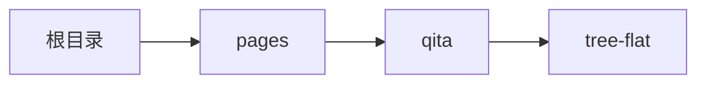

# 思维导图 xTreeFlat
-------
<ViewMobile url="/pages/qita/tree-flat" />

## 介绍

主要用来展示平面树平面结构,思维导图的展示。大数据量时：布局阶段对子树高/宽与节点尺寸做了缓存，连线绘制用 id 索引替代全表查找；请保证各节点 id 全局唯一。

## 平台兼容

| Harmony | H5 | andriod | IOS | 小程序 | UTS | UNIAPP-X SDK | version |
| --- | --- | --- | --- | --- | --- | --- | --- |
| ☑ | ☑ | ☑️ | ☑️ | ☑️ | ☑️ | 4.76+ | 1.1.18 |


## 文件路径

``` ts

@/uni_modules/tmx-ui/components/x-tree-flat/x-tree-flat.uvue
```


## 使用

``` ts

<x-tree-flat></x-tree-flat>
```

## Props 属性

| 名称 | 说明 | 类型 | 默认值 |
| ------ | ---- | ---- | ---- |
| canvasWidth | ``<br> | `` | `800` |
| canvasHeight | ``<br> | `` | `800` |
| width | ``<br> | `` | `'100%'` |
| height | ``<br> | `` | `'600'` |
| list | ``<br> | `` | `[] as XTREEFLAT_NODES[]` |
| opts | ``<br> | `` | `():XTreeFlatOpts null =>{     return null }` |
| autoFit | ``<br> | `` | `true` |


## Events 事件

| 名称 | 参数 | 说明 |
| ------ | ---- | ---- |
| init | `-` | 引擎初始化完成,可以进行通过ref来异步设置数据 |
| change | `-` | 当list数据被编辑变动时触发 |
| click | `item:XTREEFLAT_CHILDREN` | 当前节点被点击时触发 |


## Slots 插槽

| 名称 | 说明 | 数据 |
| ------ | ---- | ---- |


## Ref 方法

| 名称 | 参数 | 返回值 | 说明 |
| ------ | ---- | ---- | ---- |
| setData | `list: XTREEFLAT_NODES[]` <br>  - `树形节点数据数组` <br>  | `-` | 设置树形组件的数据 |
| fitView | ` <br> boolean` <br>  - `[shrinkOnly=true] true=只缩小不放大；false=允许放大以填满视口` <br>  | `-` | 自动适配缩放并居中显示 |


## 示例文件路径

``` json

/pages/qita/tree-flat
```



## 示例源码

::: details uvue

<<< ../../../../pages/qita/tree-flat.uvue{vue}

:::

