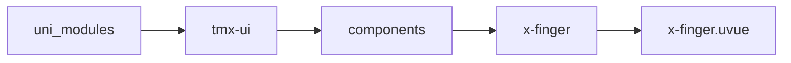
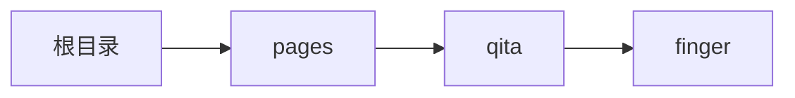

# 手势库 xFinger
-------
<ViewMobile url="/pages/qita/finger" />

## 介绍

多方向的手势库,包括旋转，捏合，轻扫，双击等手势

## 平台兼容

| Harmony | H5 | andriod | IOS | 小程序 | UTS | UNIAPP-X SDK | version |
| --- | --- | --- | --- | --- | --- | --- | --- |
| ☑ | ☑ | ☑️ | ☑️ | ☑️ | ☑️ | 4.76+ | 1.1.18 |


## 文件路径

``` ts

@/uni_modules/tmx-ui/components/x-finger/x-finger.uvue
```



## 使用

``` ts

<x-finger></x-finger>
```

## Props 属性

| 名称 | 说明 | 类型 | 默认值 |
| ------ | ---- | ---- | ---- |
| swiperDiff | `滑动多长距离，识别并触发滑动的方向`<br> | `number` | `50` |
| dbClickDiff | `定义双击的时间间隔触发时机`<br> | `number` | `300` |
| clickDiff | `定义单击click的时间间隔触发时机`<br> | `number` | `50` |
| longDiff | `定义长按的时间间隔触发时机`<br> | `number` | `800` |
| disabled | `是否禁用`<br> | `boolean` | `false` |
| throttleDelay | `移动事件的节流间隔（毫秒），0表示不节流`<br> | `number` | `16` |
| debounce | `是否启用防抖，防止快速连续触发`<br> | `boolean` | `false` |
| minMoveDistance | `最小移动距离，小于此距离不触发移动事件`<br> | `number` | `1` |
| accOffsetX | `连续性坐标初始位置x`<br> | `number` | `0` |
| accOffsetY | `连续性坐标初始位置y`<br> | `number` | `0` |
| accessibility | `是否启用无障碍访问支持`<br> | `boolean` | `true` |
| ariaLabel | `无障碍标签`<br> | `string` | `'手势识别区域'` |


## Events 事件

| 名称 | 参数 | 说明 |
| ------ | ---- | ---- |
| start | `evt: x,y,type,width,height` | 触摸开始 |
| move | `evt: x,y,type,width,height` | 触摸移动时触发 |
| end | `evt: x,y,type,width,height` | 触摸结束 |
| cancel | `evt: x,y,type,width,height` | 触摸中断 |
| doubleClick | `evt: x,y,type,width,height` | doubleClick |
| longPress | `evt: x,y,type,width,height` | 长按事件 |
| swiper | `evt: union` | 滑动时触发 |
| click | `evt: x,y,type,width,height` | 单击 |
| pinch | `undefinedevt: x,y,x1,y1,len,scale,type,width,height` | 缩放事件 |
| rotate | `undefinedevt: x,y,x1,y1,len,angle,type,width,height` | 旋转事件 |


## Slots 插槽

| 名称 | 说明 | 数据 |
| ------ | ---- | ---- |
| default | `默认插槽default` | x: number<br>x: number<br>x: number<br>x: number<br>x: string<br>y: number<br>y: number<br>y: number<br>y: number<br>y: string<br>accX: number<br>accX: number<br>accX: number<br>accX: number<br>accX: string<br>accY: number<br>accY: number<br>accY: number<br>accY: number<br>accY: string<br>type: number<br>type: number<br>type: number<br>type: number<br>type: string<br> |


## Ref 方法

| 名称 | 参数 | 返回值 | 说明 |
| ------ | ---- | ---- | ---- |


## 示例文件路径

``` json

/pages/qita/finger
```



## 示例源码

::: details uvue

<<< ../../../../pages/qita/finger.uvue{vue}

:::

