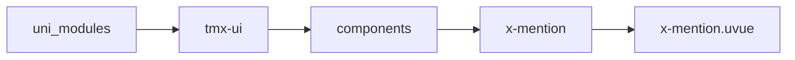
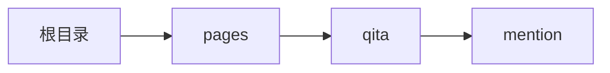

# 提及 xMention
-------
<ViewMobile url="/pages/qita/mention" />

## 介绍

它是依照微信的输入体验来的,请自行体验效果,样式是可以直接在标签上写style来定义你想的外观.

## 平台兼容

| Harmony | H5 | andriod | IOS | 小程序 | UTS | UNIAPP-X SDK | version |
| --- | --- | --- | --- | --- | --- | --- | --- |
| ☑ | ☑ | ☑️ | ☑️ | ☑️ | ☑️ | 4.76+ | 1.1.18 |


## 文件路径

``` ts

@/uni_modules/tmx-ui/components/x-mention/x-mention.uvue
```



## 使用

``` ts

<x-mention></x-mention>
```

## Props 属性

| 名称 | 说明 | 类型 | 默认值 |
| ------ | ---- | ---- | ---- |
| bgColor | `输入框背景及标签背景`<br> | `string` | `"#f5f5f5"` |
| darkBgColor | `输入框的暗黑背景色`<br>`空值读取全局的Input暗黑背景色`<br> | `string` | `""` |
| btnColor | `右边按钮主题色，空取全局主题色`<br> | `string` | `""` |
| fontSize | `文本大小`<br> | `string` | `"16"` |
| fontColor | `文本颜色，暗黑时取白`<br> | `string` | `"#333333"` |
| width | `宽`<br> | `string` | `"auto"` |
| height | `高`<br> | `string` | `"40"` |
| round | `圆角`<br> | `string` | `""` |
| placeholder | `输入提示词,请输入内容，@选择朋友,按确认完成`<br> | `string` | `""` |
| modelValue | `双向绑定`<br> | `string` | `""` |
| mentionChar | `提及符号`<br> | `string` | `"@"` |
| autFoucs | ``<br> | `boolean` | `false` |
| adjustPosition | ``<br> | `boolean` | `false` |
| holdKeyboard | ``<br> | `boolean` | `false` |
| beforeRemove | ``<br> | `MENTION_BEFOREREMOVE_TYPE` | `(tag : string) : boolean => {     return true }` |


## Events 事件

| 名称 | 参数 | 说明 |
| ------ | ---- | ---- |
| change | `value: string` | 字符变化时触发 |
| mention | `-` | 输入提及符时触发 |
| removemention | `value: string` | 用记在删除字符时,如果触发删除标签时触发 |
| confirm | `value: string` | 键盘确认时触发. |
| input | `value: string` | 输入时触发. |
| blur | `-` | 失去焦点 |
| foucs | `-` | 获得焦点 |
| keyboardheightchange | `height: number` | 键盘高度变化时 |
| update:modelValue | `-` | - |


## Slots 插槽

| 名称 | 说明 | 数据 |
| ------ | ---- | ---- |


## Ref 方法

| 名称 | 参数 | 返回值 | 说明 |
| ------ | ---- | ---- | ---- |
| setFoucus | - | `-` | - |


## 示例文件路径

``` json

/pages/qita/mention
```



## 示例源码

::: details uvue

<<< ../../../../pages/qita/mention.uvue{vue}

:::

