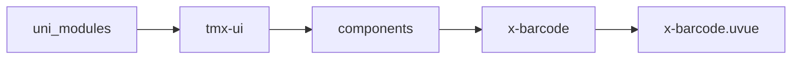
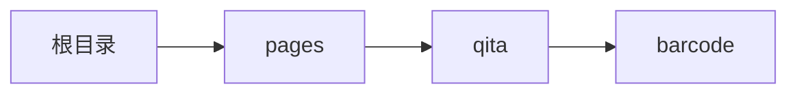

# 条码 xBarcode
-------
<ViewMobile url="/pages/qita/barcode" />

## 介绍

一维码：ean13、ean8、upca、code128、code39、itf25（交叉二五）、codabar；其中 codebar 与 code128 共用 Code128 子集 B 绘制。
ean13/ean8/upca 请按 GS1 位数与校验规则提供内容；codabar 须以 A/B/C/D 起止（如 A12345A）。

## 平台兼容

| Harmony | H5 | andriod | IOS | 小程序 | UTS | UNIAPP-X SDK | version |
| --- | --- | --- | --- | --- | --- | --- | --- |
| ☑ | ☑ | ☑️ | ☑️ | ☑️ | ☑️ | 4.76+ | 1.1.18 |


## 文件路径

``` ts

@/uni_modules/tmx-ui/components/x-barcode/x-barcode.uvue
```



## 使用

``` ts

<x-barcode></x-barcode>
```

## Props 属性

| 名称 | 说明 | 类型 | 默认值 |
| ------ | ---- | ---- | ---- |
| width | `窗口宽`<br> | `string` | `'auto'` |
| height | `宽器高，这将影响条码的高度`<br> | `string` | `'140px'` |
| pading | `上下间隙，单位是px`<br> | `number` | `20` |
| color | `条码颜色`<br> | `string` | `"black"` |
| encode | `codebar / code128：Code 128 子集 B（原 codebar 命名保留兼容）`<br>`ean13 / ean8 / upca：商品码；itf25：纯数字，奇数位前自动补 0`<br>`code39：大写与数字等；codabar：须含合法起止符 A–D`<br> | `string` | `"ean13"` |
| text | `条码内容`<br> | `string` | `""` |


## Events 事件

| 名称 | 参数 | 说明 |
| ------ | ---- | ---- |


## Slots 插槽

| 名称 | 说明 | 数据 |
| ------ | ---- | ---- |


## Ref 方法

| 名称 | 参数 | 返回值 | 说明 |
| ------ | ---- | ---- | ---- |


## 示例文件路径

``` json

/pages/qita/barcode
```



## 示例源码

::: details uvue

<<< ../../../../pages/qita/barcode.uvue{vue}

:::

