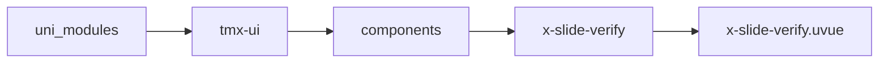
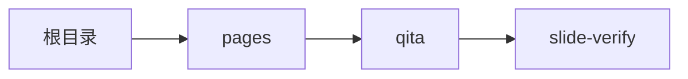

# 滑动验证 xSlideVerify
-------
<ViewMobile url="/pages/qita/slide-verify" />

## 介绍

可以防止机器人刷新页面，防止恶意注册，防止恶意评论等

## 平台兼容

| Harmony | H5 | andriod | IOS | 小程序 | UTS | UNIAPP-X SDK | version |
| --- | --- | --- | --- | --- | --- | --- | --- |
| ☑ | ☑ | ☑️ | ☑️ | ☑️ | ☑️ | 4.76+ | 1.1.18 |


## 文件路径

``` ts

@/uni_modules/tmx-ui/components/x-slide-verify/x-slide-verify.uvue
```



## 使用

``` ts

<x-slide-verify></x-slide-verify>
```

## Props 属性

| 名称 | 说明 | 类型 | 默认值 |
| ------ | ---- | ---- | ---- |
| width | `宽，允许使用auto,百分比，数字，带单位的字符串`<br> | `string` | `'auto'` |
| height | `高不允许使用auto`<br> | `string` | `'50'` |
| color | `未激活背景色`<br> | `string` | `'#e9ecf0'` |
| activeColor | `激活时的状态背景色，空取全局`<br> | `string` | `''` |
| darkColor | `暗黑时的未激活背景色`<br> | `string` | `'#21232c'` |
| successColor | `验证通过时的背景色`<br> | `string` | `'success'` |
| failColor | `验证失败时的背景色`<br> | `string` | `'error'` |
| btnColor | `按钮背景`<br> | `string` | `'white'` |
| btnDarkColor | `暗黑按钮背景，如果为空取sheetDarkColor`<br> | `string` | `'#3b3e4d'` |
| btnFontColor | `空取全局主题色`<br> | `string` | `""` |
| btnFontSize | `按钮上的图标大小`<br> | `string` | `"20"` |
| verifyPos | `验证正确的位置`<br>`0-100是百分比，让用户滑动到哪个位置触发验证正确。`<br> | `number` | `100` |
| showVerifyBox | `是否显示目标指示框`<br> | `boolean` | `false` |
| tipsText | `默认的提示验证文本,请拖动到指定位置`<br> | `string` | `""` |
| tipsTextSuccess | `失败时的文本,验证成功`<br> | `string` | `""` |
| tipsTextFail | `成功时的文本,验证失败`<br> | `string` | `""` |
| tipsTextColor | `底部提示文本颜色`<br> | `string` | `"#b8b8b8"` |
| round | `圆角`<br> | `string` | `"25"` |
| resetAuto | `验证失败时，是否自动重置`<br> | `boolean` | `true` |


## Events 事件

| 名称 | 参数 | 说明 |
| ------ | ---- | ---- |
| start | `-` | 开始拖动验证时触发 |
| success | `-` | 验证成功时触发 |
| fail | `-` | 验证失败时触发 |
| completed | `-` | 用户拖放结束时触发 |
| reset | `-` | 重置时触发 |


## Slots 插槽

| 名称 | 说明 | 数据 |
| ------ | ---- | ---- |
| activeLabel | `激活时的标签插槽` | - |
| btn | `拖动时的按钮插槽` | - |
| target | `目标虚拟框位置的插槽` | - |
| label | `未激活时的标签插槽` | - |


## Ref 方法

| 名称 | 参数 | 返回值 | 说明 |
| ------ | ---- | ---- | ---- |
| reset | - | `-` | - |


## 示例文件路径

``` json

/pages/qita/slide-verify
```



## 示例源码

::: details uvue

<<< ../../../../pages/qita/slide-verify.uvue{vue}

:::

