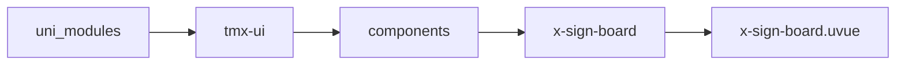
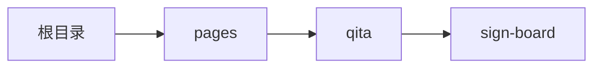

# 签名板 xSignBoard
-------
<ViewMobile url="/pages/qita/sign-board" />

## 介绍

手写签名板，适合需要签字的场景

## 平台兼容

| Harmony | H5 | andriod | IOS | 小程序 | UTS | UNIAPP-X SDK | version |
| --- | --- | --- | --- | --- | --- | --- | --- |
| ☑ | ☑ | ☑️ | ☑️ | ☑️ | ☑️ | 4.76+ | 1.1.18 |


## 文件路径

``` ts

@/uni_modules/tmx-ui/components/x-sign-board/x-sign-board.uvue
```



## 使用

``` ts

<x-sign-board></x-sign-board>
```

## Props 属性

| 名称 | 说明 | 类型 | 默认值 |
| ------ | ---- | ---- | ---- |
| width | `宽度，可任意单位`<br> | `string` | `'100%'` |
| height | `高度，可任意单位`<br> | `string` | `'150'` |
| backgroundColor | `背景颜色`<br> | `string` | `'rgba(0,0,0,0)'` |
| strokeColor | `画笔颜色`<br> | `string` | `'primary'` |
| strokeWidth | `画笔粗细`<br> | `number` | `8` |
| penType | `笔型`<br>`default：默认圆润笔峰，速度越快越细，起收笔圆润`<br>`pen：钢笔/刀峰效果，笔画锋利，转折尖锐，下压粗上提细`<br>`pencil：铅笔效果，粗细均匀，带轻微颗粒质感`<br> | `xSignBoardPenType` | `'default'` |


## Events 事件

| 名称 | 参数 | 说明 |
| ------ | ---- | ---- |


## Slots 插槽

| 名称 | 说明 | 数据 |
| ------ | ---- | ---- |


## Ref 方法

| 名称 | 参数 | 返回值 | 说明 |
| ------ | ---- | ---- | ---- |
| getLineCount | - | `-` | 获取笔画数量 * |
| clear | - | `-` | 清空画布 * |
| back | - | `-` | 回退步数 * |
| go | - | `-` | 前进步数 * |
| getImage | - | `-` | 获取图片数据 * |


## 示例文件路径

``` json

/pages/qita/sign-board
```



## 示例源码

::: details uvue

<<< ../../../../pages/qita/sign-board.uvue{vue}

:::

