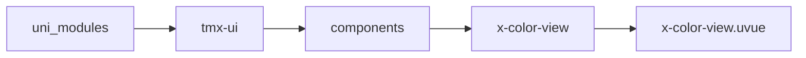
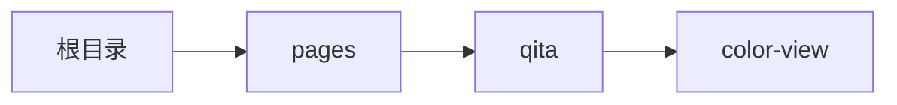

# 颜色选择 xColorView
-------
<ViewMobile url="/pages/qita/color-view" />

## 介绍

精致且方便用户操作移动颜色选择容器,为你的APP增彩,兼容PC端操作，如果要把组件嵌套在弹层内时，那么在展示的时候需要延迟显示本组件。

## 平台兼容

| Harmony | H5 | andriod | IOS | 小程序 | UTS | UNIAPP-X SDK | version |
| --- | --- | --- | --- | --- | --- | --- | --- |
| ☑ | ☑ | ☑️ | ☑️ | ☑️ | ☑️ | 4.76+ | 1.1.18 |


## 文件路径

``` ts

@/uni_modules/tmx-ui/components/x-color-view/x-color-view.uvue
```



## 使用

``` ts

<x-color-view></x-color-view>
```

## Props 属性

| 名称 | 说明 | 类型 | 默认值 |
| ------ | ---- | ---- | ---- |
| modelValue | `当前显示的颜色值,可以是合法的值,可以v-model双向绑定`<br>`如:颜色名称,hex,rgb,rgba,hsl,hsla等值`<br> | `string` | `""` |
| format | `输出格式:hex,rgba,hsla`<br>`如果输出hex,那么透明度将丢失`<br> | `string` | `'rgba'` |
| panel | `默认显示的面板`<br>`hue:光谱,rgb:rgb拖动条,grid:网格面板`<br> | `string` | `'hue'` |
| showAlpha | `是否展示透明度设置`<br> | `boolean` | `true` |
| colorList | `默认的底部颜色快速选择.`<br> | `string[]` | `() : string[] => [] as string[]` |


## Events 事件

| 名称 | 参数 | 说明 |
| ------ | ---- | ---- |
| change | `hexstr: string` | 值变化时触发。 |
| panelChange | `type: string` | 当用户切换面板时触发 |
| update:modelValue | `hexstr: string` | 值变化时触发。可以v-model绑定. |


## Slots 插槽

| 名称 | 说明 | 数据 |
| ------ | ---- | ---- |
| default | `默认插槽,用于自行布局底部,比如当你需要改造尾部时用.你也可以通过插槽来隐藏底部` | rgba: string<br> |


## Ref 方法

| 名称 | 参数 | 返回值 | 说明 |
| ------ | ---- | ---- | ---- |
| getAlpha | - | `-` | 获取当前颜色的透明度 |
| getColor | - | `-` | 获取当前颜色,含alpha通道 |
| getColorNoAlpha | - | `-` | 获取当前颜色,不含alpha通道 |


## 示例文件路径

``` json

/pages/qita/color-view
```



## 示例源码

::: details uvue

<<< ../../../../pages/qita/color-view.uvue{vue}

:::

