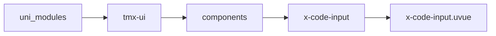
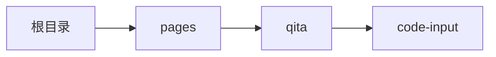

# 验证码输入框 xCodeInput
-------
<ViewMobile url="/pages/qita/code-input" />

## 介绍

验证码输入框，截止4.22安卓会自动拉起系统键盘，ios无法使用系统键盘。目前仅配合我的组件键盘可以全局兼容。已向官方返回Input的bug

## 平台兼容

| Harmony | H5 | andriod | IOS | 小程序 | UTS | UNIAPP-X SDK | version |
| --- | --- | --- | --- | --- | --- | --- | --- |
| ☑ | ☑ | ☑️ | ☑️ | ☑️ | ☑️ | 4.76+ | 1.1.18 |


## 文件路径

``` ts

@/uni_modules/tmx-ui/components/x-code-input/x-code-input.uvue
```



## 使用

``` ts

<x-code-input></x-code-input>
```

## Props 属性

| 名称 | 说明 | 类型 | 默认值 |
| ------ | ---- | ---- | ---- |
| autoFocus | `进入时自动获取焦点，并弹出系统自带的键盘(需要useSysKeyborad=true)。`<br> | `boolean` | `false` |
| useSysKeyborad | `是否使用系统自带的键盘。，如果为false你需要自行配置输入键盘`<br>`比如使用我的keyborad键盘组件。`<br> | `boolean` | `true` |
| modelValue | `当前输入的值`<br> | `string` | `""` |
| maxlength | `最大长度`<br> | `number` | `4` |
| gutter | `间距`<br> | `string` | `"8"` |
| width | `验证码框的宽`<br> | `string` | `"50"` |
| height | `验证码框的高`<br> | `string` | `"50"` |
| fontColor | `当前输入项激活时的文字颜色同时也是高亮时的背景色。`<br>`默认取全局主题`<br> | `string` | `""` |
| darkFontColor | `暗黑时的主题色，不填写等同fontColor`<br> | `string` | `""` |
| fontSize | `文字大小`<br> | `string` | `"21"` |
| round | `圆角`<br> | `string` | `"8"` |
| bgColor | `skin = fill时的背景`<br> | `string` | `"#f0f0f0"` |
| darkBgColor | `skin = fill时的暗黑背景`<br> | `string` | `"#272727"` |
| borderColor | `skin = outline时的边线颜色`<br> | `string` | `""` |
| darkBorderColor | `skin = outline时的暗黑边线颜色`<br> | `string` | `""` |
| unBorderColor | `skin = outline时的边线颜色[非激活时]`<br> | `string` | `"#e3e3e3"` |
| unDarkBorderColor | `skin = outline时的暗黑边线颜色[非激活时]`<br> | `string` | `"#2c2b2c"` |
| skin | ``<br> | `union` | `"outline"` |
| placeShape | `待输入时的占位形状`<br>`line线型`<br>`round圆形`<br>`空值表示不需要占位符号`<br> | `string` | `"round"` |


## Events 事件

| 名称 | 参数 | 说明 |
| ------ | ---- | ---- |
| click | `-` | 输入框点击时触发 |
| confirm | `value: String` | 自带键盘上确认或者达到指定长度位数时触发，可能会多次触发 |
| change | `value: String` | 输入时触发 |
| update:modelValue | `-` | 等同vmodel，可与我的keyborad键盘配合使用。 |


## Slots 插槽

| 名称 | 说明 | 数据 |
| ------ | ---- | ---- |


## Ref 方法

| 名称 | 参数 | 返回值 | 说明 |
| ------ | ---- | ---- | ---- |


## 示例文件路径

``` json

/pages/qita/code-input
```



## 示例源码

::: details uvue

<<< ../../../../pages/qita/code-input.uvue{vue}

:::

