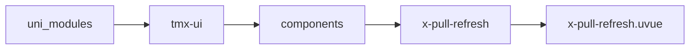
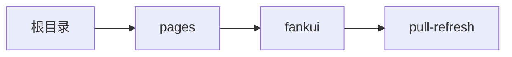

# 下拉刷新 xPullRefresh
-------
<ViewMobile url="/pages/fankui/pull-refresh" />

## 介绍

请注意内容下拉内置了mode模式即可以是listview,也可以是scrollview组件进行渲染,请了解各自功能.

## 平台兼容

| Harmony | H5 | andriod | IOS | 小程序 | UTS | UNIAPP-X SDK | version |
| --- | --- | --- | --- | --- | --- | --- | --- |
| ☑ | ☑ | ☑️ | ☑️ | ☑️ | ☑️ | 4.76+ | 1.1.18 |


## 文件路径

``` ts

@/uni_modules/tmx-ui/components/x-pull-refresh/x-pull-refresh.uvue
```



## 使用

``` ts

<x-pull-refresh></x-pull-refresh>
```

## Props 属性

| 名称 | 说明 | 类型 | 默认值 |
| ------ | ---- | ---- | ---- |
| height | `高，可以是百分比，px,rpx等单位数字或者字符串。`<br> | `string` | `'100%'` |
| pullHeight | `下拉区域触发刷新的高度`<br> | `number` | `60` |
| color | `图标颜色,空值时取全局主题色。`<br> | `string` | `""` |
| textColor | `文字颜色,空值时取全局主题色。`<br> | `string` | `""` |
| modelValue | `当前是否在刷新中。请在事件refresh中设置为false来结束刷新。`<br> | `boolean` | `false` |
| modelBottomStatus | `底部的刷新状态`<br> | `boolean` | `false` |
| mode | `内部使用哪种组件来渲染列表。可用值:listview,scrollview`<br> | `string` | `"scrollview"` |
| showScrollbar | `是否显示滚动条`<br> | `boolean` | `true` |
| disabledPull | `是否禁用下拉刷新`<br> | `boolean` | `false` |
| disabledBottom | `是否禁用触底刷新`<br> | `boolean` | `false` |


## Events 事件

| 名称 | 参数 | 说明 |
| ------ | ---- | ---- |
| refresh | `-` | 下拉触发了刷新 |
| bottomRefresh | `-` | 触底刷新 |
| update:modelBottomStatus | `-` | 等同v-model:model-bottom-status |
| scroll | `-` | 滚动的时候触发 |
| scrollDirection | `-` | 滚动方向 |
| update:modelValue | `-` | - |


## Slots 插槽

| 名称 | 说明 | 数据 |
| ------ | ---- | ---- |
| default | `默认插槽` | - |
| pull | `-` | - |
| bottom | `-` | - |


## Ref 方法

| 名称 | 参数 | 返回值 | 说明 |
| ------ | ---- | ---- | ---- |
| setScrollTop | - | `-` | 设置滚动距离 * |
| setScrollIntoView | - | `-` | 设置滚动到指定元素 * |


## 示例文件路径

``` json

/pages/fankui/pull-refresh
```



## 示例源码

::: details uvue

<<< ../../../../pages/fankui/pull-refresh.uvue{vue}

:::

