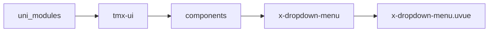
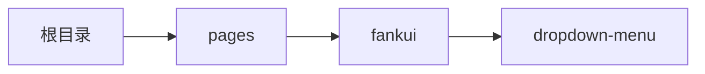

# 下拉菜单 xDropdownMenu
-------
<ViewMobile url="/pages/fankui/dropdown-menu" />

## 介绍

下拉菜单，标签内只能放置子项目x-dropdown-item

## 平台兼容

| Harmony | H5 | andriod | IOS | 小程序 | UTS | UNIAPP-X SDK | version |
| --- | --- | --- | --- | --- | --- | --- | --- |
| ☑ | ☑ | ☑️ | ☑️ | ☑️ | ☑️ | 4.76+ | 1.1.18 |


## 文件路径

``` ts

@/uni_modules/tmx-ui/components/x-dropdown-menu/x-dropdown-menu.uvue
```



## 使用

``` ts

<x-dropdown-menu></x-dropdown-menu>
```

## Props 属性

| 名称 | 说明 | 类型 | 默认值 |
| ------ | ---- | ---- | ---- |
| position | `位置，`<br>`static \`<br>` fixed`<br>`静态 \`<br>` 展开后悬浮在顶部。`<br> | `string` | `"fixed"` |
| offsetTop | `顶部的偏移量，针对你们自定标题导航时可能需要让出顶部位置。`<br>`数字字符，prx,px等单位`<br>`如果position=static此属性失效。`<br> | `string` | `"0"` |
| modelValue | `当前激活的索引`<br>`-1表示关闭。提供值时请大于-1,`<br>`如果不想要变量控制，可不提供。交由内部自行处理。`<br>`当你想要用变量控制开关时可v-model="索引"来控制关闭和打开。`<br> | `number` | `-1` |
| height | `菜单栏的高度`<br> | `string` | `"44"` |
| width | `宽度`<br> | `string` | `"auto"` |
| color | `背景颜色`<br> | `string` | `"white"` |
| darkColor | `暗黑时的背景颜色`<br> | `string` | `""` |
| zIndex | `层级`<br> | `number` | `88` |
| hidnMask | `对于要把此组件嵌套在fiexd中时,并且position为static时`<br>`请一定设置为true,否则在web端会出现层级混乱(这是css dom规则所定)`<br>`为了全平台对齐请嵌套组件时一定注意使用事项.`<br> | `boolean` | `false` |


## Events 事件

| 名称 | 参数 | 说明 |
| ------ | ---- | ---- |
| change | `index: numberkeyName: stringstatus: boolean` | 切换菜单时触发 |
| update:modelValue | `-` | - |


## Slots 插槽

| 名称 | 说明 | 数据 |
| ------ | ---- | ---- |
| default | `默认插槽，只能放置子项目x-dropdown-item` | - |


## Ref 方法

| 名称 | 参数 | 返回值 | 说明 |
| ------ | ---- | ---- | ---- |
| addMenu | - | `-` | - |
| delMenu | - | `-` | - |


## 示例文件路径

``` json

/pages/fankui/dropdown-menu
```



## 示例源码

::: details uvue

<<< ../../../../pages/fankui/dropdown-menu.uvue{vue}

:::

