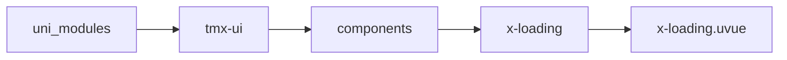

# 加载中 xLoading
-------
<ViewMobile url="/pages/fankui/loading" />

## 介绍

加载中占位符，场景用到页面加载前。请在标签内写上你的文本, 如果不写，默认显示"加载中..."

## 平台兼容

| Harmony | H5 | andriod | IOS | 小程序 | UTS | UNIAPP-X SDK | version |
| --- | --- | --- | --- | --- | --- | --- | --- |
| ☑ | ☑ | ☑️ | ☑️ | ☑️ | ☑️ | 4.76+ | 1.1.18 |


## 文件路径

``` ts

@/uni_modules/tmx-ui/components/x-loading/x-loading.uvue
```



## 使用

``` ts

<x-loading></x-loading>
```

## Props 属性

| 名称 | 说明 | 类型 | 默认值 |
| ------ | ---- | ---- | ---- |
| color | `图标颜色`<br> | `string` | `"#8b8b8b"` |
| textColor | `文字颜色`<br> | `string` | `"#8b8b8b"` |
| textSize | `文字大小`<br> | `string` | `"12"` |
| iconSize | `图标大小`<br> | `string` | `"21"` |
| vertical | `是否垂直，默认是水平`<br> | `boolean` | `true` |
| icon | `图标`<br> | `string` | `"loader-line"` |
| hideText | `隐藏加载文本插槽`<br> | `boolean` | `false` |
| label | `加载中的文本,加载中...`<br> | `string` | `""` |


## Events 事件

| 名称 | 参数 | 说明 |
| ------ | ---- | ---- |


## Slots 插槽

| 名称 | 说明 | 数据 |
| ------ | ---- | ---- |
| default | `请在插槽内写上你的文本, 如果不写，默认显示"加载中..."` | - |


## Ref 方法

| 名称 | 参数 | 返回值 | 说明 |
| ------ | ---- | ---- | ---- |


## 示例文件路径

``` json

/pages/fankui/loading
```


## 示例源码

::: details uvue

<<< ../../../../pages/fankui/loading.uvue{vue}

:::

