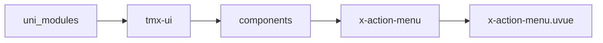
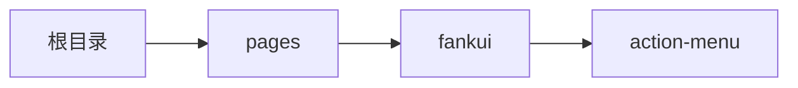

# 动作菜单面板 xActionMenu
-------
<ViewMobile url="/pages/fankui/action-menu" />

## 介绍

从底部弹出来的操作菜单。

## 平台兼容

| Harmony | H5 | andriod | IOS | 小程序 | UTS | UNIAPP-X SDK | version |
| --- | --- | --- | --- | --- | --- | --- | --- |
| ☑ | ☑ | ☑️ | ☑️ | ☑️ | ☑️ | 4.76+ | 1.1.18 |


## 文件路径

``` ts

@/uni_modules/tmx-ui/components/x-action-menu/x-action-menu.uvue
```



## 使用

``` ts

<x-action-menu></x-action-menu>
```

## Props 属性

| 名称 | 说明 | 类型 | 默认值 |
| ------ | ---- | ---- | ---- |
| customStyle | `自定义遮罩样式`<br> | `string` | `""` |
| title | `标题,请选择`<br> | `string` | `""` |
| showTitle | `是否显示标题`<br> | `boolean` | `true` |
| showClose | `是否显示关闭`<br> | `boolean` | `false` |
| overlayClick | `遮罩是否允许点击被关闭`<br> | `boolean` | `true` |
| cellClickClose | `选项点击时，是否允许关闭弹层。`<br> | `boolean` | `true` |
| show | `显示可v-model:show双向绑定`<br> | `boolean` | `false` |
| showCancel | `显示取消按钮`<br> | `boolean` | `true` |
| duration | `动画时间`<br> | `number` | `350` |
| round | `打开方向为上和下时的圆角`<br>`空值时，取全局配置的圆角。注意是取drawer的圆角，统一弹层的圆角`<br> | `string` | `""` |
| maxHeight | `弹层最大的高度值，默认为屏幕的可视高`<br>`提供值时不能为百分比，可以是px,rpx单位数字。如果你不带单位，默认转换为rpx单位。`<br> | `string` | `""` |
| list | `菜单条目`<br> | `Array` | `():XACTION_MENU_ITEM_INFO[] => [] as XACTION_MENU_ITEM_INFO[]` |
| space | `弹层的层，两边是否留空白间隙，包括底部。`<br> | `boolean` | `true` |
| watiDuration | `打开dom的延迟量，如果你打开 弹窗在ios正常。`<br>`请不要修改此值。如果遇到打不开，或者 打开 后没动画，关闭不了等可能是sdk bug导致 `<br>`此时需要加大值来避免。具体加多少以你弹窗内的节点复杂度有关，需要你自行压力测试。`<br>`此值仅在ios下生效。`<br> | `number` | `120` |


## Events 事件

| 名称 | 参数 | 说明 |
| ------ | ---- | ---- |
| cancel | `-` | 取消时触发 |
| click | `-` | 点击遮罩事件 |
| close | `-` | 关闭是触发 |
| open | `-` | 打开时触发 |
| beforeOpen | `-` | 打开前执行 |
| beforeClose | `-` | 关闭前执行 |
| update:show | `-` | 等同v-model:show |
| item-click | `index: Number` | 项目被点击时触发 |


## Slots 插槽

| 名称 | 说明 | 数据 |
| ------ | ---- | ---- |
| trigger | `标签触发显示遮罩，免于使用变量控制` | show: Boolean<br> |
| title | `标题插槽` | show: Boolean<br> |
| default | `默认插槽` | - |


## Ref 方法

| 名称 | 参数 | 返回值 | 说明 |
| ------ | ---- | ---- | ---- |
| open | - | `-` | 打开 * |
| close | - | `-` | 关闭 * |


## 示例文件路径

``` json

/pages/fankui/action-menu
```



## 示例源码

::: details uvue

<<< ../../../../pages/fankui/action-menu.uvue{vue}

:::

