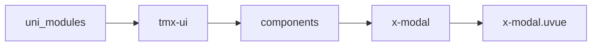
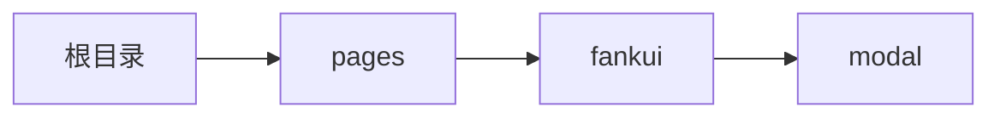

# 对话框 xModal
-------
<ViewMobile url="/pages/fankui/modal" />

## 介绍

可全局统一更改风格。

## 平台兼容

| Harmony | H5 | andriod | IOS | 小程序 | UTS | UNIAPP-X SDK | version |
| --- | --- | --- | --- | --- | --- | --- | --- |
| ☑ | ☑ | ☑️ | ☑️ | ☑️ | ☑️ | 4.76+ | 1.1.18 |


## 文件路径

``` ts

@/uni_modules/tmx-ui/components/x-modal/x-modal.uvue
```



## 使用

``` ts

<x-modal></x-modal>
```

## Props 属性

| 名称 | 说明 | 类型 | 默认值 |
| ------ | ---- | ---- | ---- |
| customStyle | `自定义遮罩样式`<br> | `string` | `""` |
| title | `标题`<br> | `string` | `""` |
| showFooter | `显示底部操作栏`<br> | `boolean` | `true` |
| showTitle | `是否显示底部关闭按钮`<br> | `boolean` | `true` |
| showClose | `是否显示底部关闭按钮`<br> | `boolean` | `false` |
| showCancel | `显示取消按钮`<br> | `boolean` | `true` |
| overlayClick | `遮罩是否允许点击被关闭`<br> | `boolean` | `true` |
| show | `显示可v-model:show双向绑定`<br> | `boolean` | `false` |
| duration | `动画时间`<br> | `number` | `300` |
| watiDuration | `打开dom的延迟量，如果你打开 弹窗在ios正常。`<br>`请不要修改此值。如果遇到打不开，或者 打开 后没动画，关闭不了等可能是sdk bug导致 `<br>`此时需要加大值来避免。具体加多少以你弹窗内的节点复杂度有关，需要你自行压力测试。`<br>`此值仅在ios下生效。`<br> | `number` | `120` |
| cancelText | `取消按钮的文本`<br> | `string` | `""` |
| confirmText | `确认按钮的文本`<br> | `string` | `""` |
| round | `打开方向为上和下时的圆角`<br>`空值时，取全局配置的圆角。`<br> | `string` | `""` |
| width | `宽，百分比，Px,rpx，auto都支持`<br> | `string` | `"84%"` |
| height | `宽，百分比，Px,rpx，auto都支持`<br> | `string` | `"240px"` |
| maxHeight | `可以是百分比,px,rpx单位数字。如果你不带单位，默认转换为rpx单位。`<br> | `string` | `"80%"` |
| disabledScroll | `是否禁用内部的scroll标签`<br>`禁用后内容不会滚动，如果设定了指定高，内容超出指定高，会被裁切`<br>`但如果没有指定高，内容自动的话，高是自动的。`<br>`有这个属性是因为截止4.03scroll-view里面放input不会上推键盘，及内部的view touchMove会失效。`<br> | `boolean` | `false` |
| bgColor | `容器背景色`<br> | `string` | `"white"` |
| darkBgColor | `暗黑时的容器背景色，不填写的话取sheetDarkColor`<br> | `string` | `""` |
| zIndex | `层级`<br> | `string` | `"1105"` |
| contentPadding | `内容区域的间隙`<br> | `string` | `"16"` |
| btnColor | `底部按钮操作的主题色，空取全局`<br> | `string` | `""` |
| beforeClose | `关闭前异步执行的函数，如果返回false阻止关闭，返回true允许关闭`<br>`必须返回的是Promise异步函数，且类型返回值必须是Promise<boolean>，不然会报错。`<br> | `callbackType` | `() : Promise<boolean> => {return Promise.resolve(true)}` |
| closeColor | `关闭图标的颜色`<br> | `string` | `"#e6e6e6"` |
| closeDarkColor | `关闭图标的暗黑颜色`<br> | `string` | `"#545454"` |
| disabled | `是否禁用弹出（它是禁用插槽内的弹出不是禁用你手动打开)`<br> | `boolean` | `false` |


## Events 事件

| 名称 | 参数 | 说明 |
| ------ | ---- | ---- |
| click | `-` | 点击遮罩事件 |
| close | `-` | 关闭是触发 |
| open | `-` | 打开时触发 |
| beforeOpen | `-` | 打开前执行 |
| beforeClose | `-` | 关闭前执行 |
| update:show | `-` | 等同v-model:show |
| cancel | `-` | 取消时触发 |
| confirm | `-` | 确认时触发 |


## Slots 插槽

| 名称 | 说明 | 数据 |
| ------ | ---- | ---- |
| trigger | `标签触发显示遮罩，免于使用变量控制` | - |
| title | `标题插槽` | - |
| default | `默认插槽` | - |
| footer | `底部操作栏` | - |


## Ref 方法

| 名称 | 参数 | 返回值 | 说明 |
| ------ | ---- | ---- | ---- |
| open | - | `-` | 打开 * |
| close | - | `-` | 关闭 * |


## 示例文件路径

``` json

/pages/fankui/modal
```



## 示例源码

::: details uvue

<<< ../../../../pages/fankui/modal.uvue{vue}

:::

