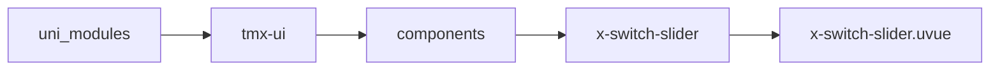

# 左滑菜单 xSwitchSlider
-------
<ViewMobile url="/pages/fankui/switch-slider" />

## 介绍

常用于对话聊天，订单列表等一些隐藏式按钮设计场景。如果子菜单无法定宽或者被挤夺请写style:flex-shrink: 0;避免。

## 平台兼容

| Harmony | H5 | andriod | IOS | 小程序 | UTS | UNIAPP-X SDK | version |
| --- | --- | --- | --- | --- | --- | --- | --- |
| ☑ | ☑ | ☑️ | ☑️ | ☑️ | ☑️ | 4.76+ | 1.1.18 |


## 文件路径

``` ts

@/uni_modules/tmx-ui/components/x-switch-slider/x-switch-slider.uvue
```



## 使用

``` ts

<x-switch-slider></x-switch-slider>
```

## Props 属性

| 名称 | 说明 | 类型 | 默认值 |
| ------ | ---- | ---- | ---- |
| custonmStyle | `被拖动层的自定义样式`<br> | `string` | `""` |
| custonmMenuStyle | `菜单容器层自定义样式`<br> | `string` | `""` |
| width | `宽度`<br> | `string` | `"100%"` |
| height | `高度，单位随意`<br> | `string` | `"50"` |
| disabled | `是否禁用`<br> | `boolean` | `false` |
| threshold | `当滑动时小于此值，会回弹到原位`<br> | `number` | `15` |
| duration | `当打开或者松开时的动画时间`<br> | `number` | `450` |
| status | `当前打开状态`<br> | `boolean` | `false` |
| borderColor | `下边线的颜色`<br> | `string` | `"#f5f5f5"` |
| borderDarkColor | `下边线暗黑的颜色，不提供取全局borderDarkColor`<br> | `string` | `""` |
| eventNone | `让拖动层内容失去响应`<br> | `boolean` | `true` |
| showBottomBorder | `是否显示下边线`<br> | `boolean` | `true` |


## Events 事件

| 名称 | 参数 | 说明 |
| ------ | ---- | ---- |
| disabledScrollChange | `-` | - |
| click | `-` | - |
| open | `-` | - |
| close | `-` | - |
| start | `-` | - |
| end | `-` | - |
| move | `-` | - |
| update:status | `-` | - |
| longTimePress | `-` | - |


## Slots 插槽

| 名称 | 说明 | 数据 |
| ------ | ---- | ---- |
| default | `默认插槽，你的顶层布局可以在这里。` | - |
| menu | `菜单插槽` | status: boolean<br> |


## Ref 方法

| 名称 | 参数 | 返回值 | 说明 |
| ------ | ---- | ---- | ---- |
| open | - | `-` | 打开 * |
| close | - | `-` | 关闭 * |
| setOpts | - | `-` | - |
| callEmits | - | `-` | - |


## 示例文件路径

``` json

/pages/fankui/switch-slider
```


## 示例源码

::: details uvue

<<< ../../../../pages/fankui/switch-slider.uvue{vue}

:::

