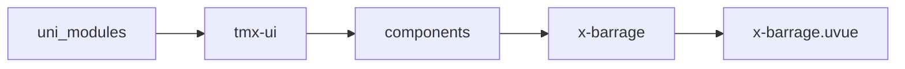
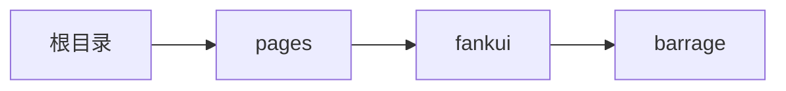

# 弹幕 Barrage
-------
<ViewMobile url="/pages/fankui/barrage" />

## 介绍

弹幕，当前版本比较初级。

## 平台兼容

| Harmony | H5 | andriod | IOS | 小程序 | UTS | UNIAPP-X SDK | version |
| --- | --- | --- | --- | --- | --- | --- | --- |
| ☑ | ☑ | ☑️ | ☑️ | ☑️ | ☑️ | 4.76+ | 1.1.18 |


## 文件路径

``` ts

@/uni_modules/tmx-ui/components/x-barrage/x-barrage.uvue
```



## 使用

``` ts

<x-barrage></x-barrage>
```

## Props 属性

| 名称 | 说明 | 类型 | 默认值 |
| ------ | ---- | ---- | ---- |
| layerHeight | `弹幕的总高度。如果你的容器高小于此高会被裁切。`<br> | `String` | `''` |
| list | `字符数组`<br> | `Array` | `():string[] => []` |


## Events 事件

| 名称 | 参数 | 说明 |
| ------ | ---- | ---- |


## Slots 插槽

| 名称 | 说明 | 数据 |
| ------ | ---- | ---- |
| default | `默认内容插槽，内容的高度至少要大于弹幕整体的layerHeight高度。` | - |


## Ref 方法

| 名称 | 参数 | 返回值 | 说明 |
| ------ | ---- | ---- | ---- |


## 示例文件路径

``` json

/pages/fankui/barrage
```



## 示例源码

::: details uvue

<<< ../../../../pages/fankui/barrage.uvue{vue}

:::

