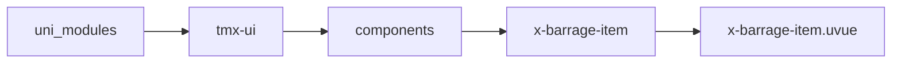
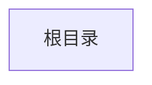

# 弹幕子节点 BarrageItem
-------
<ViewMobile url="" />

## 介绍

弹幕内部私有组件，不要引用。

## 平台兼容

| Harmony | H5 | andriod | IOS | 小程序 | UTS | UNIAPP-X SDK | version |
| --- | --- | --- | --- | --- | --- | --- | --- |
| ☑ | ☑ | ☑️ | ☑️ | ☑️ | ☑️ | 4.76+ | 1.1.18 |


## 文件路径

``` ts

@/uni_modules/tmx-ui/components/x-barrage-item/x-barrage-item.uvue
```



## 使用

``` ts

<x-barrage-item></x-barrage-item>
```

## Props 属性

| 名称 | 说明 | 类型 | 默认值 |
| ------ | ---- | ---- | ---- |
| speed | `速度`<br> | `number` | `30` |
| label | ``<br> | `string` | `""` |
| boxWidth | `速度`<br> | `number` | `0` |
| index | ``<br> | `number` | `0` |
| data | ``<br> | `BARRAGE_ITEM_AR[]` | `() : BARRAGE_ITEM_AR[] => [] as BARRAGE_ITEM_AR[]` |


## Events 事件

| 名称 | 参数 | 说明 |
| ------ | ---- | ---- |


## Slots 插槽

| 名称 | 说明 | 数据 |
| ------ | ---- | ---- |


## Ref 方法

| 名称 | 参数 | 返回值 | 说明 |
| ------ | ---- | ---- | ---- |


## 示例文件路径

``` json


```



## 示例源码

::: details uvue


:::

