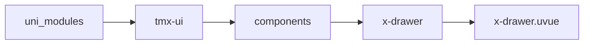
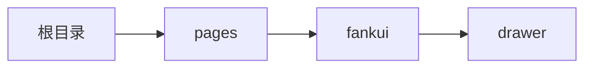

# 抽屉 xDrawer
-------
<ViewMobile url="/pages/fankui/drawer" />

## 介绍

提供四个方向的弹出。

## 平台兼容

| Harmony | H5 | andriod | IOS | 小程序 | UTS | UNIAPP-X SDK | version |
| --- | --- | --- | --- | --- | --- | --- | --- |
| ☑ | ☑ | ☑️ | ☑️ | ☑️ | ☑️ | 4.76+ | 1.1.18 |


## 文件路径

``` ts

@/uni_modules/tmx-ui/components/x-drawer/x-drawer.uvue
```



## 使用

``` ts

<x-drawer></x-drawer>
```

## Props 属性

| 名称 | 说明 | 类型 | 默认值 |
| ------ | ---- | ---- | ---- |
| customStyle | `自定义遮罩样式`<br> | `string` | `""` |
| customWrapStyle | `自定义容器背景层样式`<br> | `string` | `""` |
| customFooterStyle | `自定底部样式。`<br> | `string` | `""` |
| title | `标题`<br> | `string` | `""` |
| showFooter | `显示底部操作栏`<br> | `boolean` | `false` |
| showTitle | `是否显示标题`<br> | `boolean` | `true` |
| showClose | `是否显示底部关闭按钮`<br> | `boolean` | `false` |
| overlayClick | `遮罩是否允许点击被关闭`<br> | `boolean` | `true` |
| show | `显示可v-model:show双向绑定`<br> | `boolean` | `false` |
| showCancel | `显示取消按钮`<br> | `boolean` | `true` |
| cancelText | `取消按钮的文本`<br> | `string` | `""` |
| confirmText | `确认按钮的文本`<br> | `string` | `""` |
| duration | `动画时间`<br> | `number` | `300` |
| watiDuration | `打开dom的延迟量，如果你打开 弹窗在ios正常。`<br>`请不要修改此值。如果遇到打不开，或者 打开 后没动画，关闭不了等可能是sdk bug导致 `<br>`此时需要加大值来避免。具体加多少以你弹窗内的节点复杂度有关，需要你自行压力测试。`<br>`此值仅在ios下生效。`<br> | `number` | `120` |
| position | `打开方向。`<br> | `positionType` | `"bottom"` |
| round | `打开方向为上和下时的圆角`<br>`空值时，取全局配置的圆角。`<br>`如果你的位置是左右也想要圆角，那么这个值一定要填写，不会取全局值，主要是左右值不太好看取全局值`<br>`会干扰现有布局体系。因此为了向下兼容默认本身空值时，相当于左右时还是无圆角，但你填了值时就会起效。`<br> | `string` | `""` |
| size | `左右时为内容宽，`<br>`上下时为内容高`<br>`百分比，数字字符或者带单位,或者为auto(根据内容自动高度或者宽高)`<br>`设置为auto时，内容滚动需要关闭在微信上（:disabledScroll="true"）`<br> | `string` | `"50%"` |
| maxHeight | `弹层最大的高度值，默认为屏幕的可视高`<br>`提供值时不能为百分比，可以是px,rpx单位数字。如果你不带单位，默认转换为rpx单位。`<br> | `string` | `""` |
| bgColor | `背景颜色`<br> | `string` | `'white'` |
| darkBgColor | `暗黑背景颜色，如果不提供默认读取全局的sheet配置`<br> | `string` | `''` |
| overflayBgColor | `遮罩的背景色`<br> | `string` | `'rgba(0, 0, 0, 0.4)'` |
| disabledScroll | `是否禁用内部的scroll标签`<br>`禁用后内容不会滚动，如果设定了指定高，内容超出指定高，会被裁切`<br>`但如果没有指定高，内容自动的话，高是自动的。`<br> | `boolean` | `false` |
| disabled | `是否禁用弹出（它是禁用插槽内的弹出不是禁用你手动打开)`<br> | `boolean` | `false` |
| contentMargin | `内容区域左右和下的边距。`<br> | `string` | `'16'` |
| widthCoverCenter | `宽屏时是否让内容剧中显示`<br>`并限制其宽为屏幕宽，只展示中间内容以适应宽屏。`<br>`注意只有top,bottom才会生效。`<br> | `boolean` | `false` |
| swiperLenClose | `滑动左右或者上下关闭弹出层`<br>`注意如果设置为0就表示关闭该功能。`<br>`默认drawer嵌套了scroll-view，再你滚动到顶或者底时，如果继续滑动的距离大于此值关闭层。`<br>`但如果你是禁用了内部scroll-view，而是采用自己的scorll-view，此时该功能会与你的滚动手势冲突，请自行考虑。`<br>`建议要打开时设置为80-100比较合理`<br> | `number` | `0` |
| offsetTop | `距离顶部的偏移量,如果你布局顶会遮罩弹层可以考虑使用此值`<br> | `string` | `'0'` |
| offsetBottom | `距离底部的偏移量,如果你布局底会遮罩弹层可以考虑使用此值`<br> | `string` | `'0'` |
| zIndex | `弹层的层级`<br> | `number` | `1100` |
| lazy | `懒加载`<br>`为了解决业务布局节点超多时,你可能需要内容延迟加载以免阻塞动画流畅度.`<br>`如果你启用了lazy,每次打开时,动画执行后才会显示内容.这样动画就流畅,不会因为节点过多造成的卡.`<br>`开启了此属性后ios端前面的watiDuration属性可以不用再设置了.`<br> | `boolean` | `false` |
| disabledConfirm | `是否禁用确认按钮`<br> | `boolean` | `false` |
| btnColor | `底部按钮操作的主题色，空取全局`<br> | `string` | `""` |
| beforeClose | `关闭前异步执行的函数，如果返回false阻止关闭，返回true允许关闭`<br>`必须返回的是Promise异步函数，且类型返回值必须是Promise<boolean>，不然会报错。`<br> | `callbackType` | `() : Promise<boolean> => {     return Promise.resolve(true) }` |
| closeColor | `关闭图标的颜色`<br> | `string` | `"#e6e6e6"` |
| closeDarkColor | `关闭图标的暗黑颜色`<br> | `string` | `"#545454"` |


## Events 事件

| 名称 | 参数 | 说明 |
| ------ | ---- | ---- |
| click | `-` | 点击遮罩事件 |
| close | `-` | 关闭是触发 |
| open | `-` | 打开时触发 |
| beforeOpen | `-` | 打开前执行 |
| beforeClose | `-` | 关闭前执行 |
| update:show | `-` | 等同v-model:show |
| cancel | `-` | 取消时触发 |
| confirm | `-` | 确认时触发 |


## Slots 插槽

| 名称 | 说明 | 数据 |
| ------ | ---- | ---- |
| trigger | `标签触发显示遮罩，免于使用变量控制` | show: Boolean<br> |
| contentTop | `内容顶部的额外插槽，仅为下向上弹出（position=bottom)下才会显示。` | - |
| bg | `背景插槽，可以布局在内容下方。你可在此布局：背景图，渐变（使用view）等其它自己想实现的个性化的背景设计要求。` | - |
| title | `标题插槽` | show: Boolean<br> |
| default | `默认插槽` | - |
| footer | `底部操作栏` | - |


## Ref 方法

| 名称 | 参数 | 返回值 | 说明 |
| ------ | ---- | ---- | ---- |
| open | - | `-` | 打开 * |
| close | - | `-` | 关闭 * |


## 示例文件路径

``` json

/pages/fankui/drawer
```



## 示例源码

::: details uvue

<<< ../../../../pages/fankui/drawer.uvue{vue}

:::

