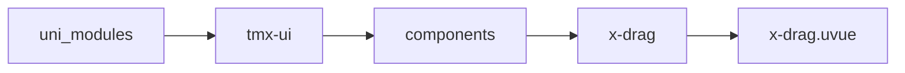
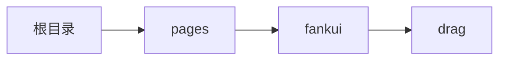

# 拖拽排序 xDrag
-------
<ViewMobile url="/pages/fankui/drag" />

## 介绍

自由布局拖拽排序组件,列或者宫格都支持。使用时,需要将需要拖拽排序的子元素设置为x-drag-item。
并且子元素和父元素不允许通过style来动态设置宽高,否则拖拽排序会失效。并且list及子元素中的order不允许动态设置,否则拖拽排序会失效。
想要动态修改数据可以通过vif切换重新渲染下。web支持响应式屏幕。本插件：引用了原生插件x-vibrate-s

## 平台兼容

| Harmony | H5 | andriod | IOS | 小程序 | UTS | UNIAPP-X SDK | version |
| --- | --- | --- | --- | --- | --- | --- | --- |
| ☑ | ☑ | ☑️ | ☑️ | ☑️ | ☑️ | 4.76+ | 1.1.18 |


## 文件路径

``` ts

@/uni_modules/tmx-ui/components/x-drag/x-drag.uvue
```



## 使用

``` ts

<x-drag></x-drag>
```

## Props 属性

| 名称 | 说明 | 类型 | 默认值 |
| ------ | ---- | ---- | ---- |
| itemHeight | `项目的高度,不要动态更改`<br> | `string` | `'50'` |
| col | `列数，默认1即列表布局,不要动态更改。1以上为宫格布局`<br> | `number` | `1` |
| list | `排序数据list，变动后通过change事件取得`<br> | `Array` | `() : UTSJSONObject[] => [] as UTSJSONObject[]` |
| scrollDiff | `拖动时滚动进步值`<br> | `number` | `25` |


## Events 事件

| 名称 | 参数 | 说明 |
| ------ | ---- | ---- |
| change | `-` | 排序变动时触发 |
| move | `-` | 拖动时触发,可根据参数进行滚动。向上为负,向下为正 |
| end | `-` | - |
| start | `-` | - |


## Slots 插槽

| 名称 | 说明 | 数据 |
| ------ | ---- | ---- |
| default | `只可放置子组件x-drag-item` | - |


## Ref 方法

| 名称 | 参数 | 返回值 | 说明 |
| ------ | ---- | ---- | ---- |
| addItem | - | `-` | - |
| delItem | - | `-` | - |
| updataResize | - | `-` | - |


## 示例文件路径

``` json

/pages/fankui/drag
```



## 示例源码

::: details uvue

<<< ../../../../pages/fankui/drag.uvue{vue}

:::

