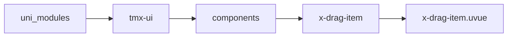
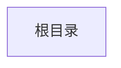

# 拖拽排序子组件 xDragItem
-------
<ViewMobile url="" />

## 介绍

仅可放置在父容器x-drag中，如果在组件上写style时，不可写left,top,width,height等属性来影响组件的高和宽。
也不可直接写padding,margin来影响组件的位置。你可以在组件中自己写view后，再自由的布局写间隙等。

## 平台兼容

| Harmony | H5 | andriod | IOS | 小程序 | UTS | UNIAPP-X SDK | version |
| --- | --- | --- | --- | --- | --- | --- | --- |
| ☑ | ☑ | ☑️ | ☑️ | ☑️ | ☑️ | 4.76+ | 1.1.18 |


## 文件路径

``` ts

@/uni_modules/tmx-ui/components/x-drag-item/x-drag-item.uvue
```



## 使用

``` ts

<x-drag-item></x-drag-item>
```

## Props 属性

| 名称 | 说明 | 类型 | 默认值 |
| ------ | ---- | ---- | ---- |
| order | `索引，vfor时提供index,必填。一定是正确的索引列表顺序`<br> | `number` | `0` |
| disabled | `禁用本项目被拖动，禁用时顺序会被固定`<br> | `boolean` | `false` |


## Events 事件

| 名称 | 参数 | 说明 |
| ------ | ---- | ---- |
| click | `-` | - |


## Slots 插槽

| 名称 | 说明 | 数据 |
| ------ | ---- | ---- |
| default | `默认插槽` | - |


## Ref 方法

| 名称 | 参数 | 返回值 | 说明 |
| ------ | ---- | ---- | ---- |
| setOrderIndex | - | `-` | - |
| setActivdId | - | `-` | - |
| setStylSetProperty | - | `-` | - |
| getStylSetProperty | - | `-` | - |
| updateForce | - | `-` | - |
| updatePos | - | `-` | - |


## 示例文件路径

``` json


```



## 示例源码

::: details uvue


:::

