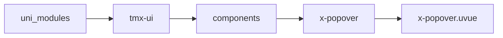
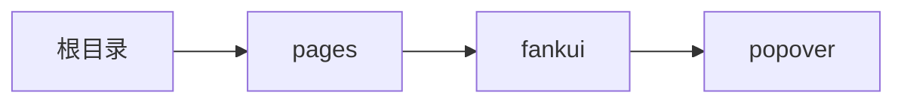

# 汽泡菜单 xPopover
-------
<ViewMobile url="/pages/fankui/popover" />

## 介绍

汽泡菜单,警告:如果你弹出的内容比如文本,它会自动宽和高,是个特殊组件在web上,此类需要固定下宽.
建议内容要自己写个固定宽或者高性能更好。另外sdk4.57开始，在微信端你的菜单内容最好不要动态更改导致宽和高动态变化，在微信端只会记录首次的
内容区域的宽和高（触发插槽不限制），如果确实在微信端要动态变更内容可以vif整体组件或者改变key来刷新组件解决。非微信端无此限制。

## 平台兼容

| Harmony | H5 | andriod | IOS | 小程序 | UTS | UNIAPP-X SDK | version |
| --- | --- | --- | --- | --- | --- | --- | --- |
| ☑ | ☑ | ☑️ | ☑️ | ☑️ | ☑️ | 4.76+ | 1.1.18 |


## 文件路径

``` ts

@/uni_modules/tmx-ui/components/x-popover/x-popover.uvue
```



## 使用

``` ts

<x-popover></x-popover>
```

## Props 属性

| 名称 | 说明 | 类型 | 默认值 |
| ------ | ---- | ---- | ---- |
| position | `弹出的位置。`<br>`'bc'\`<br>`'br'\`<br>`'bl'\`<br>`'tr'\`<br>`'tc'\`<br>`'tl'`<br>`底中\`<br>`底右\`<br>`底左\`<br>`顶右\`<br>`顶中\`<br>`顶左`<br> | `xPopopverPosType` | `'bc'` |
| keyName | `如果你的弹出层内容是异步加载。`<br>`你需要刷新下此key以刷新位置。如果你是vif一来切换或者显示前内容是固定的，则不需要刷新此值。`<br> | `number` | `0` |
| modelValue | `变量控制是否显示菜单，等同v-model=""`<br>`如果你想默认显示，但不受变量控制由内部自行处理可以:model-value="true"即可`<br> | `boolean` | `false` |
| isClickClose | `点击弹出的内容是否允许关闭。`<br> | `boolean` | `true` |
| round | `容器圆角。ios如果不设置，你内容圆角没有用。`<br> | `string` | `'16'` |
| maskBgColor | `遮罩背景,默认是透明`<br> | `string` | `"rgba(0,0,0,0)"` |
| showTriangle | `是否显示指示的三角形。`<br> | `boolean` | `false` |
| triangleColor | `三角指示的背景色`<br> | `string` | `'white'` |
| triangleDarkColor | `三角指示的暗黑背景色,空取sheet暗黑背影色`<br> | `string` | `''` |
| zIndex | ``<br> | `number` | `100` |


## Events 事件

| 名称 | 参数 | 说明 |
| ------ | ---- | ---- |
| update:modelValue | `-` | - |


## Slots 插槽

| 名称 | 说明 | 数据 |
| ------ | ---- | ---- |
| default | `默认插槽触发区域，点击此插槽内容可显示菜单。` | - |
| menu | `菜单弹出区域的插槽，弹出内容可以在这里自由布局。` | - |


## Ref 方法

| 名称 | 参数 | 返回值 | 说明 |
| ------ | ---- | ---- | ---- |


## 示例文件路径

``` json

/pages/fankui/popover
```



## 示例源码

::: details uvue

<<< ../../../../pages/fankui/popover.uvue{vue}

:::

