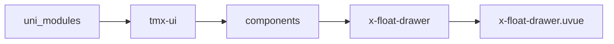
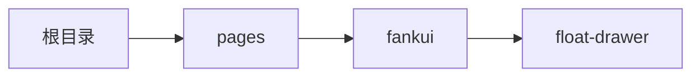

# 浮动面板 FloatDrawer
-------
<ViewMobile url="/pages/fankui/float-drawer" />

## 介绍

提供流畅的拖拉阻尼效果，回弹丝滑。右滑关闭逻辑已经实现,但在app体验不好,主要是scoll与事件冲突需要官方优化.

## 平台兼容

| Harmony | H5 | andriod | IOS | 小程序 | UTS | UNIAPP-X SDK | version |
| --- | --- | --- | --- | --- | --- | --- | --- |
| ☑ | ☑ | ☑️ | ☑️ | ☑️ | ☑️ | 4.76+ | 1.1.18 |


## 文件路径

``` ts

@/uni_modules/tmx-ui/components/x-float-drawer/x-float-drawer.uvue
```



## 使用

``` ts

<x-float-drawer></x-float-drawer>
```

## Props 属性

| 名称 | 说明 | 类型 | 默认值 |
| ------ | ---- | ---- | ---- |
| show | `显示可v-model:show双向绑定`<br>`默认是打开还是放置在底部。`<br> | `boolean` | `false` |
| onlyHeader | `是否仅允许通过标题栏拖动。`<br> | `boolean` | `false` |
| duration | `动画时间`<br> | `number` | `350` |
| round | `向上的圆角`<br>`空值时，取全局配置的圆角。`<br> | `string` | `""` |
| size | `百分比，数字字符或者带单位,`<br>`默认露出的内容高度`<br> | `string` | `"15%"` |
| maxHeight | `弹层最大的高度值，默认为屏幕的可视高`<br>`提供值时不能为百分比，可以是px,rpx单位数字。如果你不带单位，默认转换为rpx单位。`<br> | `string` | `"80%"` |
| triggerDy | `当拖动时，触发打开和关闭时的临界值，单位是px`<br>`如果没有达到此临界值时，将会回弹至原始位置。`<br> | `number` | `100` |
| threshold | `当拖动时，如果已经达到了关闭和打开时的临界值时`<br>`可以继续拖拉时缓动阻尼值`<br> | `number` | `0.045` |
| bgColor | `内容层的背景色`<br> | `string` | `"white"` |
| darkBgColor | `暗黑的背景色,空时，取全局的sheetDarkColor`<br> | `string` | `""` |
| actionColor | `拖动标题栏的横线背景色`<br> | `string` | `"#888888"` |
| disabledScroll | `禁用内部的容器并采用view容器`<br> | `boolean` | `false` |
| containerType | `没有禁用disabledScroll生效`<br>`容器内部使用的类型`<br>`scroll :scroll-view`<br>`list : list-view`<br> | `string` | `"scroll"` |
| disabled | `是否禁用用户滚动等来触发关闭或者打开。`<br> | `boolean` | `false` |
| zIndex | `层级`<br> | `number` | `100` |
| contentMargin | `控制内容的边跑,有时需要自定布局时非常有用.`<br>`请直接使用style css规则写margin,`<br> | `string` | `"0 16px 16px 16px"` |


## Events 事件

| 名称 | 参数 | 说明 |
| ------ | ---- | ---- |
| close | `-` | 关闭时执行 |
| open | `-` | 打开执行的事件 |
| beforeOpen | `-` | 打开前执行 |
| beforeClose | `-` | 关闭前执行 |
| heightChange | `-` | 高度位置变化时触发这个差值.返回参数evt是个百分比,0%是最低下,100%代表是在最顶部. |
| movestart | `-` | 开始拖动 |
| moveend | `-` | 结束拖动 |
| update:show | `-` | 等同v-model:show |


## Slots 插槽

| 名称 | 说明 | 数据 |
| ------ | ---- | ---- |
| default | `默认插槽` | show: Boolean<br>show: Number<br>height: Boolean<br>height: Number<br> |


## Ref 方法

| 名称 | 参数 | 返回值 | 说明 |
| ------ | ---- | ---- | ---- |
| setOpts | - | `-` | - |
| callEmits | - | `-` | - |
| setDisabledScolly | - | `-` | - |


## 示例文件路径

``` json

/pages/fankui/float-drawer
```



## 示例源码

::: details uvue

<<< ../../../../pages/fankui/float-drawer.uvue{vue}

:::

