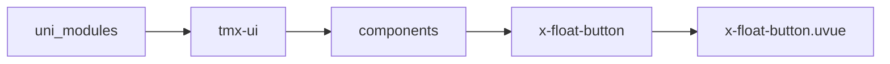
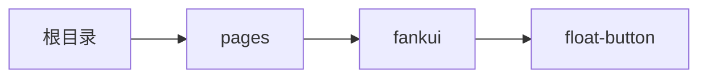

# 浮球 xFloatButton
-------
<ViewMobile url="/pages/fankui/float-button" />

## 介绍

可以左右四个角定位放置，自动靠边吸咐，也可自由拖动放置。

## 平台兼容

| Harmony | H5 | andriod | IOS | 小程序 | UTS | UNIAPP-X SDK | version |
| --- | --- | --- | --- | --- | --- | --- | --- |
| ☑ | ☑ | ☑️ | ☑️ | ☑️ | ☑️ | 4.76+ | 1.1.18 |


## 文件路径

``` ts

@/uni_modules/tmx-ui/components/x-float-button/x-float-button.uvue
```



## 使用

``` ts

<x-float-button></x-float-button>
```

## Props 属性

| 名称 | 说明 | 类型 | 默认值 |
| ------ | ---- | ---- | ---- |
| duration | ``<br> | `number` | `650` |
| threshold | `松开后，如果是吸附adsorption为true的话，吸附在两边的位置时的距离边界的距离。`<br>`单位为px,左右的安全距离.`<br> | `number` | `12` |
| thresholdTop | `单位为px,顶部的安全距离`<br> | `number` | `0` |
| thresholdBottom | `单位为px,底部的安全距离`<br> | `number` | `12` |
| round | `圆角,空值时取全局的drawr圆角。`<br> | `string` | `"64"` |
| offset | `自己定义位置:以可视范围内的左上角算起。如何自己定义位置时`<br>`需要计算屏幕坐标时请使用uni.getWindowInfo()`<br>`来获取可视屏幕的宽和高定位你自己需要的自由位置`<br>`可以v-model:offset="[x,y]"来动态更改其位置。`<br>`我预置了以下几种常见模式：`<br>`[-1,-1]会在右下角。会让出threshold边界距离`<br>`[-2,-2]会在左下角。会让出threshold边界距离`<br>`[-3,-3]会在左上角。会让出threshold边界距离`<br>`[-4,-4]会在右上角。会让出threshold边界距离`<br>`[-5,-5]会在底部居中。会让出threshold边界距离`<br> | `Array` | `(): number[] => [-1, -1] as number[]` |
| bgColor | `背景,支持渐变值如:linear-gradient(to left, #FFED46, #FF7EC7)`<br>`默认空值，取全局主题值。`<br> | `string` | `""` |
| width | `宽`<br> | `string` | `'50px'` |
| height | `高`<br> | `string` | `'50px'` |
| adsorption | `是否开启吸附在两边。`<br>`如果设置为false,可以自由拖动在屏幕上。`<br> | `boolean` | `true` |
| disabled | `是否禁止拖动。`<br> | `boolean` | `false` |
| zIndex | `层级`<br> | `number` | `87` |


## Events 事件

| 名称 | 参数 | 说明 |
| ------ | ---- | ---- |
| click | `-` | 点击组件时触发 |
| longpress | `-` | 长按组件时触发大于500ms |
| change | `number[]` | 坐标改变时触发 |
| update:offset | `-` | 动态修改当前的位置<br>等同v-model:offset具体见offset属性那。 |


## Slots 插槽

| 名称 | 说明 | 数据 |
| ------ | ---- | ---- |
| default | `请在插槽内自由布局你的样式及功能块。` | - |


## Ref 方法

| 名称 | 参数 | 返回值 | 说明 |
| ------ | ---- | ---- | ---- |


## 示例文件路径

``` json

/pages/fankui/float-button
```



## 示例源码

::: details uvue

<<< ../../../../pages/fankui/float-button.uvue{vue}

:::

