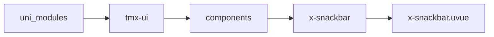
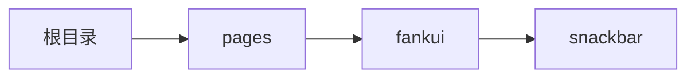

# 消息条 xSnackbar
-------
<ViewMobile url="/pages/fankui/snackbar" />

## 介绍

消息条是可以在上方或者正文累加显示，新的消息在旧的前面。而不会只显示一条，会自动消失。支持6个方向的弹出

## 平台兼容

| Harmony | H5 | andriod | IOS | 小程序 | UTS | UNIAPP-X SDK | version |
| --- | --- | --- | --- | --- | --- | --- | --- |
| ☑ | ☑ | ☑️ | ☑️ | ☑️ | ☑️ | 4.76+ | 1.1.18 |


## 文件路径

``` ts

@/uni_modules/tmx-ui/components/x-snackbar/x-snackbar.uvue
```



## 使用

``` ts

<x-snackbar></x-snackbar>
```

## Props 属性

| 名称 | 说明 | 类型 | 默认值 |
| ------ | ---- | ---- | ---- |
| offset | `距离顶/底的偏移量。`<br> | `string` | `"12px"` |
| position | `出现的位置`<br>`top:正上方`<br>`top-left:左上方`<br>`top-right:右上角`<br>`bottom-right:右下角`<br>`bottom-left:左下角`<br>`bottom:正下方`<br> | `positionType` | `"bottom"` |
| duration | `多少毫秒后销毁`<br> | `number` | `2500` |
| block | `是否让消息条横屏占满，默认是根据内容自动宽。`<br> | `boolean` | `false` |
| maxCount | `最大消息条数，超出时最早的旧消息直接移除。-1表示不限制`<br> | `number` | `-1` |
| content | `消息数据`<br>`注意，id一定要提供且是数字，可以随意，只要相对上一次变更下，就会触发`<br>`显示新的消息条。这种显示的方式就是避免你们引用ref方式来调用方法，相对更简单。`<br> | `SNACKBAR_INFO` | `():SNACKBAR_INFO=>({     background: "",     color: "",     fontSize: "",     content: "",     id: -1,     icon: "" } as SNACKBAR_INFO)` |


## Events 事件

| 名称 | 参数 | 说明 |
| ------ | ---- | ---- |


## Slots 插槽

| 名称 | 说明 | 数据 |
| ------ | ---- | ---- |


## Ref 方法

| 名称 | 参数 | 返回值 | 说明 |
| ------ | ---- | ---- | ---- |


## 示例文件路径

``` json

/pages/fankui/snackbar
```



## 示例源码

::: details uvue

<<< ../../../../pages/fankui/snackbar.uvue{vue}

:::

