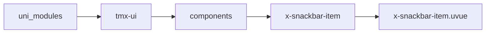
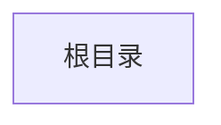

# 消息条子节点 xSnackbarItem
-------
<ViewMobile url="" />

## 介绍

xSnackbar内部子组件，不可引用。

## 平台兼容

| Harmony | H5 | andriod | IOS | 小程序 | UTS | UNIAPP-X SDK | version |
| --- | --- | --- | --- | --- | --- | --- | --- |
| ☑ | ☑ | ☑️ | ☑️ | ☑️ | ☑️ | 4.76+ | 1.1.18 |


## 文件路径

``` ts

@/uni_modules/tmx-ui/components/x-snackbar-item/x-snackbar-item.uvue
```



## 使用

``` ts

<x-snackbar-item></x-snackbar-item>
```

## Props 属性

| 名称 | 说明 | 类型 | 默认值 |
| ------ | ---- | ---- | ---- |
| duration | `多少毫秒后销毁`<br> | `number` | `2500` |
| keyIndex | `索引`<br> | `number` | `-1` |
| content | `消息数据`<br>`注意，id一定要提供且是数字，可以随意，只要相对上一次变更下，就会触发`<br>`显示新的消息条。这种显示的方式就是避免你们引用ref方式来调用方法，相对更简单。`<br> | `SNACKBAR_ITEM` | `():SNACKBAR_ITEM=>({     background: "black",     color: "white",     fontSize: "14px",     content: "",     id: -1,     icon: "" } as SNACKBAR_ITEM)` |


## Events 事件

| 名称 | 参数 | 说明 |
| ------ | ---- | ---- |
| close | `-` | 关闭事件 |


## Slots 插槽

| 名称 | 说明 | 数据 |
| ------ | ---- | ---- |


## Ref 方法

| 名称 | 参数 | 返回值 | 说明 |
| ------ | ---- | ---- | ---- |


## 示例文件路径

``` json


```



## 示例源码

::: details uvue


:::

