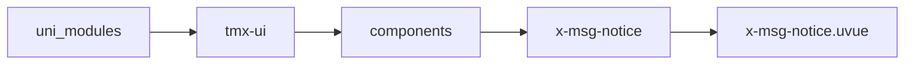
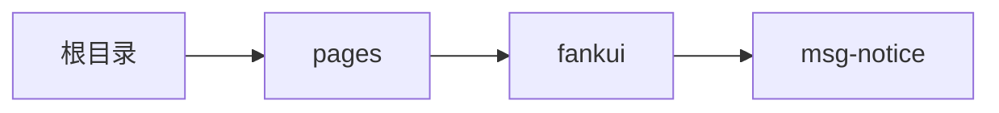

# 消息通知 xMsgNotice
-------
<ViewMobile url="/pages/fankui/msg-notice" />

## 介绍

本组件可以通过左右拖拉关闭消息，往左拉，左关闭，右拉右关闭，有阻尼回弹效果，可单独设置。

## 平台兼容

| Harmony | H5 | andriod | IOS | 小程序 | UTS | UNIAPP-X SDK | version |
| --- | --- | --- | --- | --- | --- | --- | --- |
| ☑ | ☑ | ☑️ | ☑️ | ☑️ | ☑️ | 4.76+ | 1.1.18 |


## 文件路径

``` ts

@/uni_modules/tmx-ui/components/x-msg-notice/x-msg-notice.uvue
```



## 使用

``` ts

<x-msg-notice></x-msg-notice>
```

## Props 属性

| 名称 | 说明 | 类型 | 默认值 |
| ------ | ---- | ---- | ---- |
| modelValue | `打开和关闭状态`<br>`等同v-model,如果使用:modelValue将不受控.`<br> | `boolean` | `true` |
| duration | `动画时间`<br> | `number` | `300` |
| threshold | `当滑动时小于此值，会回弹到原位。而不执行关闭`<br> | `number` | `50` |
| round | `圆角,空值时取全局的drawr圆角。`<br> | `string` | `""` |
| position | `显示位置top,bottom`<br> | `positionType` | `"bottom"` |
| offset | `距离边界的偏移量`<br> | `string` | `"12px"` |
| bgColor | `背景`<br> | `string` | `"white"` |
| darkBgColor | `暗黑的背景，如果不提供，读取sheetDarkColor`<br> | `string` | `""` |
| clickClose | `点击组件是否关闭通知`<br> | `boolean` | `true` |


## Events 事件

| 名称 | 参数 | 说明 |
| ------ | ---- | ---- |
| click | `-` | 组件点击事件 |
| update:modelValue | `-` | 等同v-model |


## Slots 插槽

| 名称 | 说明 | 数据 |
| ------ | ---- | ---- |
| default | `默认插槽` | - |


## Ref 方法

| 名称 | 参数 | 返回值 | 说明 |
| ------ | ---- | ---- | ---- |


## 示例文件路径

``` json

/pages/fankui/msg-notice
```



## 示例源码

::: details uvue

<<< ../../../../pages/fankui/msg-notice.uvue{vue}

:::

