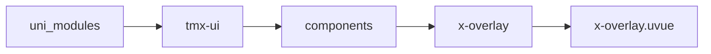
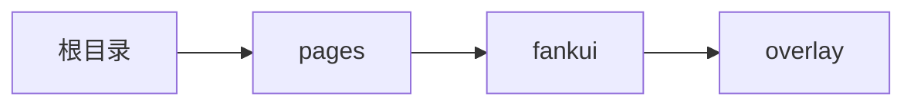

# 遮罩 xOverlay
-------
<ViewMobile url="/pages/fankui/overlay" />

## 介绍

旋转制作弹层类页面。

## 平台兼容

| Harmony | H5 | andriod | IOS | 小程序 | UTS | UNIAPP-X SDK | version |
| --- | --- | --- | --- | --- | --- | --- | --- |
| ☑ | ☑ | ☑️ | ☑️ | ☑️ | ☑️ | 4.76+ | 1.1.18 |


## 文件路径

``` ts

@/uni_modules/tmx-ui/components/x-overlay/x-overlay.uvue
```



## 使用

``` ts

<x-overlay></x-overlay>
```

## Props 属性

| 名称 | 说明 | 类型 | 默认值 |
| ------ | ---- | ---- | ---- |
| customStyle | `自定义遮罩样式`<br> | `string` | `""` |
| customContentStyle | `内容层样式`<br> | `string` | `""` |
| showClose | `是否显示底部关闭按钮`<br> | `boolean` | `false` |
| overlayClick | `遮罩是否允许点击被关闭`<br> | `boolean` | `true` |
| disabledAni | `禁用弹跳动画,overlayClick设置为false时,点底部会有弹跳.`<br> | `boolean` | `false` |
| show | `显示可v-model:show双向绑定`<br> | `boolean` | `false` |
| duration | `动画时间`<br> | `number` | `300` |
| watiDuration | `打开dom的延迟量，如果你打开 弹窗在ios正常。`<br>`请不要修改此值。如果遇到打不开，或者 打开 后没动画，关闭不了等可能是sdk bug导致 `<br>`此时需要加大值来避免。具体加多少以你弹窗内的节点复杂度有关，需要你自行压力测试。`<br>`此值仅在ios下生效。`<br> | `number` | `120` |
| zIndex | `层级`<br> | `number` | `1100` |


## Events 事件

| 名称 | 参数 | 说明 |
| ------ | ---- | ---- |
| click | `-` | 点击遮罩事件 |
| close | `-` | 关闭是触发 |
| open | `-` | 打开时触发 |
| beforeOpen | `-` | 打开前执行 |
| beforeClose | `-` | 关闭前执行 |
| update:show | `-` | 等同v-model:show |


## Slots 插槽

| 名称 | 说明 | 数据 |
| ------ | ---- | ---- |
| trigger | `标签触发显示遮罩，免于使用变量控制` | show: Boolean<br> |
| default | `-` | - |


## Ref 方法

| 名称 | 参数 | 返回值 | 说明 |
| ------ | ---- | ---- | ---- |
| open | - | `-` | 打开 * |
| close | - | `-` | 关闭 * |


## 示例文件路径

``` json

/pages/fankui/overlay
```



## 示例源码

::: details uvue

<<< ../../../../pages/fankui/overlay.uvue{vue}

:::

