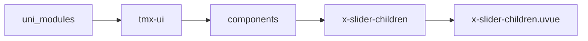
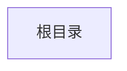

# 侧边分类子节点 xSliderTreeChildren
-------
<ViewMobile url="" />

## 介绍

xSliderTree内部子组件，不可引用

## 平台兼容

| Harmony | H5 | andriod | IOS | 小程序 | UTS | UNIAPP-X SDK | version |
| --- | --- | --- | --- | --- | --- | --- | --- |
| ☑ | ☑ | ☑️ | ☑️ | ☑️ | ☑️ | 4.76+ | 1.1.18 |


## 文件路径

``` ts

@/uni_modules/tmx-ui/components/x-slider-children/x-slider-children.uvue
```



## 使用

``` ts

<x-slider-children></x-slider-children>
```

## Props 属性

| 名称 | 说明 | 类型 | 默认值 |
| ------ | ---- | ---- | ---- |
| itemTextColor | `选项项目未选中的文字颜色`<br> | `string` | `"#333333"` |
| itemActiveColor | `选项项目选中的文字颜色，空值取全局主题`<br> | `string` | `""` |
| sliderContentBgColor | `右内容区域背景颜色`<br> | `string` | `"white"` |
| list | `数据列表`<br> | `Array` | `[] as SLIDER_TREE_ITEM[]` |
| modelValue | `当前选中项的id数组`<br> | `Array` | `[] as string[]` |
| multiple | `是否允许多选`<br> | `boolean` | `false` |
| index | `当前的索引`<br> | `number` | `0` |
| nowSelecteds | `父级选中的项。`<br> | `Array` | `[] as string[]` |
| height | `高度`<br> | `string` | `'100%'` |
| boxHeight | `容器高度`<br> | `number` | `0` |
| fontSize | `文字大小`<br> | `string` | `"16"` |


## Events 事件

| 名称 | 参数 | 说明 |
| ------ | ---- | ---- |
| back | `-` | 返回上级 |
| itemClick | `ids: string[]type: string` | 项目点击事件 |


## Slots 插槽

| 名称 | 说明 | 数据 |
| ------ | ---- | ---- |
| default | `内部节点插槽，不对外` | - |


## Ref 方法

| 名称 | 参数 | 返回值 | 说明 |
| ------ | ---- | ---- | ---- |
| getSelected | - | `-` | 获取当前选中的项 * |
| setSelected | - | `-` | 设置选中的项 * |


## 示例文件路径

``` json


```



## 示例源码

::: details uvue


:::

