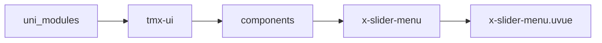
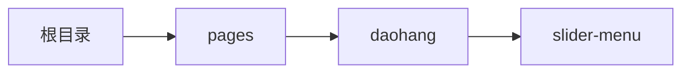

# 侧边菜单 xSliderMenu
-------
<ViewMobile url="/pages/daohang/slider-menu" />

## 介绍

左边菜单选择，右边内容区域

## 平台兼容

| Harmony | H5 | andriod | IOS | 小程序 | UTS | UNIAPP-X SDK | version |
| --- | --- | --- | --- | --- | --- | --- | --- |
| ☑ | ☑ | ☑️ | ☑️ | ☑️ | ☑️ | 4.76+ | 1.1.18 |


## 文件路径

``` ts

@/uni_modules/tmx-ui/components/x-slider-menu/x-slider-menu.uvue
```



## 使用

``` ts

<x-slider-menu></x-slider-menu>
```

## Props 属性

| 名称 | 说明 | 类型 | 默认值 |
| ------ | ---- | ---- | ---- |
| width | `宽`<br> | `string` | `"auto"` |
| height | `高是必填，不可为auto。`<br> | `string` | `"100%"` |
| showScrollbar | `是否显示滚动条`<br> | `boolean` | `false` |
| activeTextColor | `侧边选中的文字颜色，空值取全局主题`<br> | `string` | `""` |
| textColor | `侧边未选中时的文字颜色`<br> | `string` | `"#888888"` |
| fontSize | `侧边菜单文字大小`<br> | `string` | `"16"` |
| itemTextColor | `选项项目未选中的文字颜色`<br> | `string` | `"#333333"` |
| itemActiveColor | `选项项目选中的文字颜色，空值取全局主题`<br> | `string` | `""` |
| sliderBgColor | `左侧边栏背景颜色`<br> | `string` | `"#f5f5f5"` |
| darkSliderBgColor | `左侧边栏暗黑背景颜色`<br>`如果不提供，自动读取全局的backgroundColorContentDark背景色`<br> | `string` | `""` |
| sliderContentBgColor | `右内容区域背景颜色`<br> | `string` | `"white"` |
| darkSliderContentBgColor | `右内容区域暗黑背景颜色`<br>`如果不提供读取sheet窗口的暗黑背景`<br> | `string` | `""` |
| sliderWidth | `侧边栏宽`<br> | `string` | `"100"` |
| list | ``<br> | `Array` | `() : SLIDER_TREE_ITEM_INFO[] => [] as SLIDER_TREE_ITEM_INFO[]` |
| modelValue | `当前选中项的id数组`<br> | `string` | `""` |
| showToggleMenu | `是否允许侧边菜单收起和打开(会在菜单顶部出现一个收缩按钮)`<br>`这里需要你的菜单项中提供icon图标,不然收起后左侧就取项目的第一个字符.`<br> | `boolean` | `false` |
| menuPosition | `菜单位置,left或者right`<br>`默认在左侧,不可以动态更改.`<br> | `string` | `"left"` |
| itemHeight | `左侧菜单项目的高,默认44,不能为百分比,auto这种`<br>`只能是如:'44','44px','88rpx'`<br> | `string` | `"44"` |
| itemSelectedStyle | `左侧菜单项目被选中时的style样式对象,可以覆盖默认的样式-`<br>`改成自己的设计稿样式.`<br> | `UTSJSONObject` | `() : UTSJSONObject => ({} as UTSJSONObject)` |
| layoutMode | `右侧布局模式,=scroll时,右侧为动态循环的scroll-view,item插槽`<br>`上方的插槽数据启用,你需要自己在循环内布局内容.如果为default默认就是之前的`<br>`模式右侧就是一个空view,内容需要自己写滚动.`<br>`default,scroll`<br> | `string` | `"default"` |


## Events 事件

| 名称 | 参数 | 说明 |
| ------ | ---- | ---- |
| change | `id: stringindex: number` | 手动切换时触发 |
| update:modelValue | `-` | - |


## Slots 插槽

| 名称 | 说明 | 数据 |
| ------ | ---- | ---- |
| default | `默认右边插槽内容` | height: string<br>height: string<br>menuid: string<br>menuid: string<br> |
| item | `左边动态菜单插槽项目` | item: Object<br> |
| toggle | `开启收缩菜单时,显示的顶部菜单指示项目插槽,可过这里可以自定义你自己的关闭和展开的菜单指示样式.` | opened: Boolean<br> |
| menu | `左边动态菜单插槽项目` | item: Object<br> |


## Ref 方法

| 名称 | 参数 | 返回值 | 说明 |
| ------ | ---- | ---- | ---- |


## 示例文件路径

``` json

/pages/daohang/slider-menu
```



## 示例源码

::: details uvue

<<< ../../../../pages/daohang/slider-menu.uvue{vue}

:::

