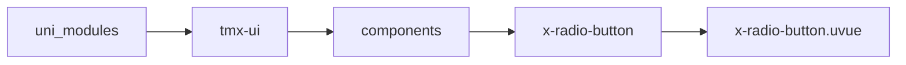
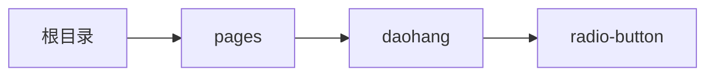

# 单选按钮组 xRadioButton
-------
<ViewMobile url="/pages/daohang/radio-button" />

## 介绍

类似单选导航按钮式或者叫分割选择按钮。

## 平台兼容

| Harmony | H5 | andriod | IOS | 小程序 | UTS | UNIAPP-X SDK | version |
| --- | --- | --- | --- | --- | --- | --- | --- |
| ☑ | ☑ | ☑️ | ☑️ | ☑️ | ☑️ | 4.76+ | 1.1.18 |


## 文件路径

``` ts

@/uni_modules/tmx-ui/components/x-radio-button/x-radio-button.uvue
```



## 使用

``` ts

<x-radio-button></x-radio-button>
```

## Props 属性

| 名称 | 说明 | 类型 | 默认值 |
| ------ | ---- | ---- | ---- |
| list | `数据`<br> | `Array` | `[] as RADIO_BUTTON[]` |
| modelValue | `当前选中的id值`<br> | `string` | `""` |
| bgColor | `背景`<br> | `string` | `"#f3f5f8"` |
| darkBgColor | `暗黑时的背景，如果不提供读取页面暗黑背景`<br> | `string` | `""` |
| activeColor | `激活的按钮块背景`<br> | `string` | `"white"` |
| darkActiveColor | `激活的按钮块暗黑背景，如果不提供inputDarkColor`<br> | `string` | `""` |
| activeFontColor | `激活时的文字颜色,默认取全局主题色。`<br> | `string` | `""` |
| fontColor | `文字颜色，暗黑时取白色`<br> | `string` | `"#333333"` |
| fontSize | `文字大小`<br> | `string` | `"16"` |
| height | `按钮组高度`<br> | `string` | `"40"` |
| space | `四周内间隙`<br> | `string` | `"2"` |
| round | `圆角,空值时读取全局配置。`<br> | `string` | `""` |
| textStyle | `文本样式，可修改文字的样式。`<br> | `string` | `""` |


## Events 事件

| 名称 | 参数 | 说明 |
| ------ | ---- | ---- |
| change | `value: stringindex: number` | 用户点击变换时触发。 |
| click | `value: stringindex: number` | 用户点击按钮时触发,不管禁没禁用。 |
| update:modelValue | `-` | - |


## Slots 插槽

| 名称 | 说明 | 数据 |
| ------ | ---- | ---- |


## Ref 方法

| 名称 | 参数 | 返回值 | 说明 |
| ------ | ---- | ---- | ---- |


## 示例文件路径

``` json

/pages/daohang/radio-button
```



## 示例源码

::: details uvue

<<< ../../../../pages/daohang/radio-button.uvue{vue}

:::

