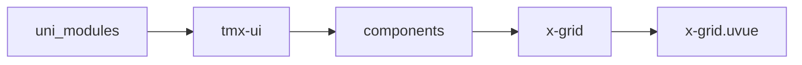
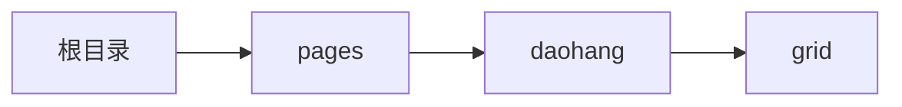

# 宫格 xGrid
-------
<ViewMobile url="/pages/daohang/grid" />

## 介绍

内部只可放置x-grid-item。

## 平台兼容

| Harmony | H5 | andriod | IOS | 小程序 | UTS | UNIAPP-X SDK | version |
| --- | --- | --- | --- | --- | --- | --- | --- |
| ☑ | ☑ | ☑️ | ☑️ | ☑️ | ☑️ | 4.76+ | 1.1.18 |


## 文件路径

``` ts

@/uni_modules/tmx-ui/components/x-grid/x-grid.uvue
```



## 使用

``` ts

<x-grid></x-grid>
```

## Props 属性

| 名称 | 说明 | 类型 | 默认值 |
| ------ | ---- | ---- | ---- |
| col | `显示几列`<br> | `number` | `3` |
| itemHeight | `项目高度`<br> | `string` | `'70'` |
| itemBgColor | `统一设置子组件的背景`<br> | `string` | `'white'` |
| bgColor | `整体宫格的背景`<br> | `string` | `'transparent'` |
| darkBgColor | `整体宫格的背景暗黑，如果为空，读取全局sheetDark`<br> | `string` | `'transparent'` |
| width | `整体宽度`<br> | `string` | `'auto'` |
| iconColor | `图标颜色`<br> | `string` | `'#333333'` |
| darkIconColor | `暗黑时图标颜色`<br> | `string` | `'#FFFFFF'` |
| textColor | `文字颜色`<br> | `string` | `'#888888'` |
| textDarkColor | `文字暗黑颜色`<br> | `string` | `''` |
| fontSize | `文字大小`<br> | `string` | `'13'` |
| iconSize | `图标大小`<br> | `string` | `'25'` |
| showBorder | `是否显示边框。请务必为每个项目配置order`<br> | `boolean` | `true` |
| borderColor | ``<br> | `string` | `'#f5f5f5'` |
| borderDarkColor | ``<br> | `string` | `'#333333'` |
| round | `圆角`<br> | `string` | `'0'` |


## Events 事件

| 名称 | 参数 | 说明 |
| ------ | ---- | ---- |


## Slots 插槽

| 名称 | 说明 | 数据 |
| ------ | ---- | ---- |
| default | `插槽内只可放置x-grid-item` | - |


## Ref 方法

| 名称 | 参数 | 返回值 | 说明 |
| ------ | ---- | ---- | ---- |


## 示例文件路径

``` json

/pages/daohang/grid
```



## 示例源码

::: details uvue

<<< ../../../../pages/daohang/grid.uvue{vue}

:::

