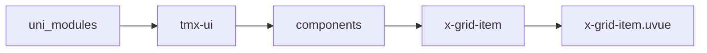
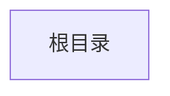

# 宫格子组件 xGridItem
-------
<ViewMobile url="" />

## 介绍

不可单独使用，请把放它在x-grid标签内。

## 平台兼容

| Harmony | H5 | andriod | IOS | 小程序 | UTS | UNIAPP-X SDK | version |
| --- | --- | --- | --- | --- | --- | --- | --- |
| ☑ | ☑ | ☑️ | ☑️ | ☑️ | ☑️ | 4.76+ | 1.1.18 |


## 文件路径

``` ts

@/uni_modules/tmx-ui/components/x-grid-item/x-grid-item.uvue
```



## 使用

``` ts

<x-grid-item></x-grid-item>
```

## Props 属性

| 名称 | 说明 | 类型 | 默认值 |
| ------ | ---- | ---- | ---- |
| bgColor | `背景，默认为空值，读取父xGrid组件统一设置的背景`<br>`如果这里提供了，以子组件为准。`<br> | `string` | `'transparent'` |
| order | `项目在列表中的索引,从0开始`<br>`请务必在循环gridItem时提供order为循环的index`<br> | `number` | `-1` |
| icon | `图标`<br> | `string` | `''` |
| text | `文字`<br> | `string` | `''` |
| iconColor | `图标颜色，空值取父xGrid的值`<br> | `string` | `''` |
| textColor | `文字亮系，空值取父xGrid的值`<br> | `string` | `''` |
| textDarkColor | `文字暗黑颜色，空值取父xGrid的值`<br> | `string` | `''` |
| fontSize | `文字大小，空值取父xGrid的值`<br> | `string` | `''` |
| iconSize | `图标大小，空值取父xGrid的值`<br> | `string` | `''` |
| isLink | `是否开启链接hover效果`<br> | `boolean` | `true` |
| url | `url链接地址，如果填写，点击会跳转`<br> | `string` | `''` |


## Events 事件

| 名称 | 参数 | 说明 |
| ------ | ---- | ---- |
| click | `-` | 项目点击时触发 |


## Slots 插槽

| 名称 | 说明 | 数据 |
| ------ | ---- | ---- |
| default | `默认插槽内容` | - |


## Ref 方法

| 名称 | 参数 | 返回值 | 说明 |
| ------ | ---- | ---- | ---- |


## 示例文件路径

``` json


```



## 示例源码

::: details uvue


:::

