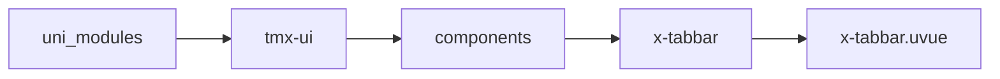
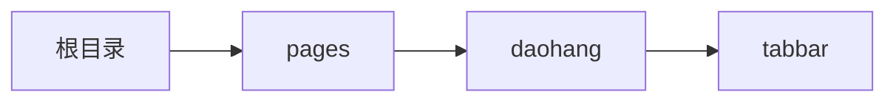

# 底部导航 xTabbar
-------
<ViewMobile url="/pages/daohang/tabbar" />

## 介绍

可定义凸起按钮。通过全局状态设置选中项，放于任何页面可自动选中。组件的镂空因平台而有兼容差异，微信和鸿蒙sdk不支持相关api，请务必is-canvas-render设置为false

## 平台兼容

| Harmony | H5 | andriod | IOS | 小程序 | UTS | UNIAPP-X SDK | version |
| --- | --- | --- | --- | --- | --- | --- | --- |
| ☑ | ☑ | ☑️ | ☑️ | ☑️ | ☑️ | 4.76+ | 1.1.18 |


## 文件路径

``` ts

@/uni_modules/tmx-ui/components/x-tabbar/x-tabbar.uvue
```



## 使用

``` ts

<x-tabbar></x-tabbar>
```

## Props 属性

| 名称 | 说明 | 类型 | 默认值 |
| ------ | ---- | ---- | ---- |
| color | `未选中时的颜色`<br> | `string` | `"#b9b9b9"` |
| selectedColor | `选中时的颜色，空值取全局主题`<br> | `string` | `""` |
| bgColor | `背景,如果你为空，会读取全局的亮色tabbar背景`<br> | `string` | `"white"` |
| darkBgColor | `暗黑时的背景，如果为空，取全局的底部导航背景色。`<br> | `string` | `""` |
| showTopBorder | `显示顶部边线，暗黑时取全局的borderDarkColor`<br> | `boolean` | `true` |
| borderColor | `边线颜色`<br> | `string` | `"#f0f0f0"` |
| fontSize | `文字大小`<br> | `string` | `"11px"` |
| iconSize | `图标大小`<br> | `string` | `"28px"` |
| autoTabbarHeight | `导航的整体高度，请使用v-model:autoTabbarHeight="x"`<br>`来获取当前的高度。外部要去变更值。这个只是对外输出，`<br>`给您 外部放在底部占位用，省得你们要一屏时计算高。外部最好computed使用，因为是异步的`<br> | `number` | `0` |
| outIndex | `需要向外凸起的项目索引。`<br>`-1表示不凸起`<br> | `number` | `2` |
| outBgColor | `凸起的背景色`<br> | `string` | `"primary"` |
| outIconColor | `凸起的图标颜色`<br> | `string` | `"white"` |
| isOutSpace | `是否开启凸起背景镂空，截止sdk 4.31 ios有bug官方已经知晓在修复`<br> | `boolean` | `true` |
| outReserve | `是否反向凸起就是不镂空，但在凸起的底层会被绘制背景。false是镂空，true表示反向包住。`<br>`截止sdk 4.31 ios有bug官方已经知晓在修复`<br> | `boolean` | `false` |
| position | `是否悬浮在底部,不可动态修改`<br>`fixed悬浮，relative静态布局。`<br> | `string` | `'fixed'` |
| linearGradient | `渐变背景，如果提供，上面的背景和暗黑背景将失效。`<br>`仅支持:to bottom,to right,to left,to top`<br>`例：['to right','#ff667f','#ff5416']`<br> | `string[]` | `() : string[] => [] as string[]` |
| list | `如果你提供了本地的list数据，那么全局的list将不会被采用，你需要自己管理激活引，`<br>`跨页面时需要你自己设置当前页面的索引，因为变量索引是无法跨页面的。`<br> | `TABBAR_ITEM_INFO[]` | `() : TABBAR_ITEM_INFO[] => [] as TABBAR_ITEM_INFO[]` |
| activeIndex | `当前激活的索引,如果你提供了本地索引，那全局的索引将失效。`<br>`跨页面时需要你自己设置当前页面的索引，因为变量索引是无法跨页面的。`<br>`仅当list不为空时有效。`<br> | `number` | `-1` |
| zIndex | `层级`<br> | `number` | `20` |
| firstRenderTimeout | `首次渲染等待时长`<br>`如果你在首页或者第一页使用时，如果渲染异常，请通过调节这个值来使用其正常`<br>`主要是针对安卓ios。对web不起效`<br>`如果是次页，时间不需要太长。时间长短时你页面渲染时长而定。`<br>`页面元素过多，排版较长时可能需要设置超过350ms，正常的次页100-150ms即可。`<br> | `number` | `300` |
| isCanvasRender | `是否开启canvas渲染引擎，开启后，可以得到`<br>`异形的镂空效果。比view渲染的更精致好看。开启后前面的firstRenderTimeout要注意阅读`<br>`两种渲染版本请自行选择使用。微信端不支持canvas渲染，有相关接口微信sdk没有对齐平台，因此一定要设置为false`<br> | `boolean` | `true` |
| bottom | `距离底部的距离（如果开启了这个，下面里面的安全距离将失效，你需要自己计算）`<br>`开启悬浮显示时，如果想要个性化时可以自行配置。填写后顶部边线也会消失不使用（因为已经用这种布局了就不需要上边了，不然不好看。）`<br> | `string` | `''` |
| width | `组件宽，允许百分比，也建议使用百分比，方便计算两边间隙。`<br>`两边的间隙会通过屏幕宽减去本宽，让导航在屏幕之间居中。`<br> | `string` | `"100%"` |
| round | `组件圆角,想要背景圆角，需要关闭cavas渲染.`<br> | `string` | `"0px"` |
| backdrop | `是否开启磨砂背景，依赖于插件x-blur-u,并且仅非Canvas下`<br>`同时背景透明需要你自行设置背景色中透明度如:rgba(255,255,255,0.85)`<br> | `boolean` | `false` |


## Events 事件

| 名称 | 参数 | 说明 |
| ------ | ---- | ---- |
| click | `index: number` | 项目被点击时触发。 |
| doubleClick | `index: number` | 项目被双击时触发。 |
| change | `index: number` | 切换项目时触发。 |
| update:autoTabbarHeight | `height: number` | 同步组件高给外部使用，请使用v-model:autoTabbarHeight<br>组件高度 = 安全栏高度 + 导航栏高度,外部最好computed使用，因为是异步的 |


## Slots 插槽

| 名称 | 说明 | 数据 |
| ------ | ---- | ---- |
| out | `凸起图标插槽。` | active: boolean<br>active: number<br>size: boolean<br>size: number<br> |
| item | `子项目插槽，以便完全自定义化样式。` | isactive: number<br>isactive: boolean<br>isactive: number<br>selfindex: number<br>selfindex: boolean<br>selfindex: number<br>children: number<br>children: boolean<br>children: number<br>activeindex: number<br>activeindex: boolean<br>activeindex: number<br> |


## Ref 方法

| 名称 | 参数 | 返回值 | 说明 |
| ------ | ---- | ---- | ---- |


## 示例文件路径

``` json

/pages/daohang/tabbar
```



## 示例源码

::: details uvue

<<< ../../../../pages/daohang/tabbar.uvue{vue}

:::

