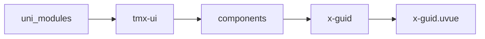
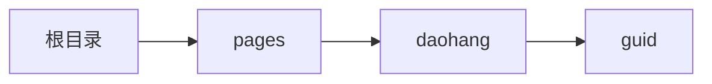

# 引导 xGuid
-------
<ViewMobile url="/pages/daohang/guid" />

## 介绍

内部只可放置x-guid-item。在app上根节点必须是scroll-view或者list-view等可滚动的页面使用。
还要设置容器:scroll-with-animation="false"禁止滚去动画。
且你的元素唯一id必须是容器的直接子节点，否则会无效(安卓会无效，为了所有平台有效，必须是容器的直接第一级子节点)。
您可以参考我的dmeo页面使用，严格按照demo使用！！！

## 平台兼容

| Harmony | H5 | andriod | IOS | 小程序 | UTS | UNIAPP-X SDK | version |
| --- | --- | --- | --- | --- | --- | --- | --- |
| ☑ | ☑ | ☑️ | ☑️ | ☑️ | ☑️ | 4.87+ | 1.1.21 |


## 文件路径

``` ts

@/uni_modules/tmx-ui/components/x-guid/x-guid.uvue
```



## 使用

``` ts

<x-guid></x-guid>
```

## Props 属性

| 名称 | 说明 | 类型 | 默认值 |
| ------ | ---- | ---- | ---- |
| maskColor | ``<br> | `string` | `'rgba(0,0,0,0.4)'` |
| activeId | `如果要双向绑定请使用v-model:active-id,您在子组件上定义的target-id属性，且是唯一的`<br> | `string` | `''` |
| defaultActiveId | ``<br> | `string` | `''` |


## Events 事件

| 名称 | 参数 | 说明 |
| ------ | ---- | ---- |
| change | `-` | 用记点上、下步时的变化 |
| update:activeId | `-` | 双向同步手动控制，默认可以不配置，如果要自行控制请v-model:activeId |
| complete | `-` | 点击完成时触发 |


## Slots 插槽

| 名称 | 说明 | 数据 |
| ------ | ---- | ---- |
| default | `插槽内只可放置x-guid-item` | - |


## Ref 方法

| 名称 | 参数 | 返回值 | 说明 |
| ------ | ---- | ---- | ---- |


## 示例文件路径

``` json

/pages/daohang/guid
```



## 示例源码

::: details uvue

<<< ../../../../pages/daohang/guid.uvue{vue}

:::

