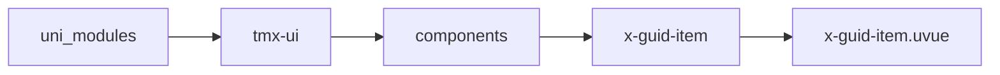
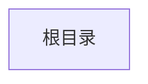

# 引导子组件 xGuidItem
-------
<ViewMobile url="" />

## 介绍

内部只可放置在x-guid内。

## 平台兼容

| Harmony | H5 | andriod | IOS | 小程序 | UTS | UNIAPP-X SDK | version |
| --- | --- | --- | --- | --- | --- | --- | --- |
| ☑ | ☑ | ☑️ | ☑️ | ☑️ | ☑️ | 4.87+ | 1.1.21 |


## 文件路径

``` ts

@/uni_modules/tmx-ui/components/x-guid-item/x-guid-item.uvue
```



## 使用

``` ts

<x-guid-item></x-guid-item>
```

## Props 属性

| 名称 | 说明 | 类型 | 默认值 |
| ------ | ---- | ---- | ---- |
| targetId | `必填；唯一标识;且不可以动态变更;可以通过重新渲染变更id;这个是目标元素上的id,`<br>`且是唯一，必须在页面中，不可以封装在子组件内，也不可以隐藏中的元素id，`<br>`必须是明确且可见的元素id`<br> | `string` | `""` |
| order | `必填；顺序索引，一般循环的index即可。`<br> | `number` | `0` |
| title | `标题`<br> | `string` | `""` |
| content | `内容描述`<br> | `string` | `""` |


## Events 事件

| 名称 | 参数 | 说明 |
| ------ | ---- | ---- |


## Slots 插槽

| 名称 | 说明 | 数据 |
| ------ | ---- | ---- |
| title | `-` | - |


## Ref 方法

| 名称 | 参数 | 返回值 | 说明 |
| ------ | ---- | ---- | ---- |


## 示例文件路径

``` json


```



## 示例源码

::: details uvue


:::

