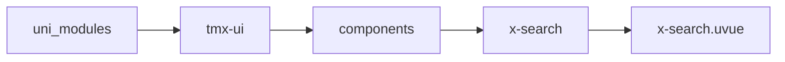

# 搜索栏 xSearch
-------
<ViewMobile url="/pages/index/search" />

## 介绍

可定制化强

## 平台兼容

| Harmony | H5 | andriod | IOS | 小程序 | UTS | UNIAPP-X SDK | version |
| --- | --- | --- | --- | --- | --- | --- | --- |
| ☑ | ☑ | ☑️ | ☑️ | ☑️ | ☑️ | 4.76+ | 1.1.18 |


## 文件路径

``` ts

@/uni_modules/tmx-ui/components/x-search/x-search.uvue
```



## 使用

``` ts

<x-search></x-search>
```

## Props 属性

| 名称 | 说明 | 类型 | 默认值 |
| ------ | ---- | ---- | ---- |
| round | `输入框圆角`<br> | `string` | `"8"` |
| showClear | `是否显示清除图标`<br> | `boolean` | `true` |
| modelValue | `双向绑定的输入值`<br> | `string` | `""` |
| placeholder | `输入框提示语`<br> | `string` | `""` |
| iconColor | `搜索图标和清除图标的颜色`<br> | `string` | `"#bfbfbf"` |
| color | `搜索条背景`<br> | `string` | `"#ffffff"` |
| cancelFontColor | `取消的文本色`<br> | `string` | `"#000000"` |
| darkColor | `暗黑模式下的搜索条背景，空值取：sheetDarkColor`<br> | `string` | `""` |
| inputBgColor | `输入框的背景`<br> | `string` | `"#f5f5f5"` |
| fontColor | `输入框的字体颜色`<br> | `string` | `"#333333"` |
| border | `边框style: [width, style, color]`<br> | `Array` | `(): string[] => [] as string[]` |
| darkBorderColor | `暗黑模式下边框颜色`<br> | `string` | `""` |
| placeholderStyle | `输入框的提示样式`<br> | `string` | `""` |
| showCancel | `是否显示右侧取消按钮`<br> | `boolean` | `true` |
| disabled | `禁用输入选择`<br> | `boolean` | `false` |
| autoFocus | `自动获得焦点`<br> | `boolean` | `false` |


## Events 事件

| 名称 | 参数 | 说明 |
| ------ | ---- | ---- |
| cancel | `-` | 取消时触发 |
| clear | `-` | 清空时触发 |
| rightClick | `-` | 点击右侧文本时触发 |
| confirm | `-` | 输入法确认搜索时触发 |
| input | `-` | 输入时触发 |
| update:modelValue | `-` | 等同 v-model |


## Slots 插槽

| 名称 | 说明 | 数据 |
| ------ | ---- | ---- |
| left | `左插槽` | - |
| inputLeft | `-` | - |
| inputRight | `-` | - |
| cancel | `-` | - |
| right | `-` | - |


## Ref 方法

| 名称 | 参数 | 返回值 | 说明 |
| ------ | ---- | ---- | ---- |


## 示例文件路径

``` json

/pages/index/search
```


## 示例源码

::: details uvue

<<< ../../../../pages/index/search.uvue{vue}

:::

