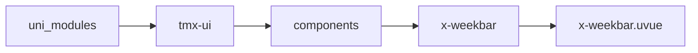
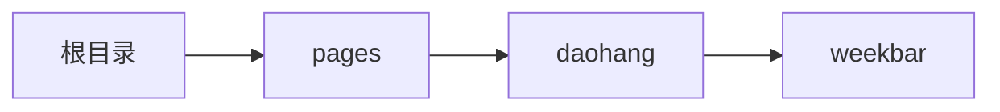

# 时间周 xWeekbar
-------
<ViewMobile url="/pages/daohang/weekbar" />

## 介绍

样式丰富,非常精美,能够适应不同设计要求.

## 平台兼容

| Harmony | H5 | andriod | IOS | 小程序 | UTS | UNIAPP-X SDK | version |
| --- | --- | --- | --- | --- | --- | --- | --- |
| ☑ | ☑ | ☑️ | ☑️ | ☑️ | ☑️ | 4.76+ | 1.1.18 |


## 文件路径

``` ts

@/uni_modules/tmx-ui/components/x-weekbar/x-weekbar.uvue
```



## 使用

``` ts

<x-weekbar></x-weekbar>
```

## Props 属性

| 名称 | 说明 | 类型 | 默认值 |
| ------ | ---- | ---- | ---- |
| modelValue | `同步受控当前选中日期，空时不会自动选中。`<br> | `string` | `""` |
| startDate | `开始的日期,提供时，请提供完整到秒的格式`<br> | `string` | `"1900-1-1 00:00:00"` |
| endDate | `结束的日期,提供时，请提供完整到秒的格式`<br> | `string` | `"2100-1-1 59:59:59"` |
| format | `格式展示在组件上的日期.`<br> | `string` | `"DD"` |
| cn | `周上面显示的中文名称.'一', '二', '三', '四', '五', '六', '日'`<br>`由于有属性seekDay的原因这里的顺序你不允许自己排列，你只能按照0-6的顺序来排列。即周一至周日，内部会自动再排列以满足seekDay的值。`<br> | `string[]` | `() : string[] => [] as string[]` |
| seekDay | `你当前的一周的第一天的索引值是几：0: 周一，1: 周二，2: 周三，3: 周四，4: 周五，5: 周六，6: 周日`<br> | `number` | `0` |
| color | `背景`<br> | `string` | `"white"` |
| darkColor | `暗黑时的背景,如果不提供使用sheet暗黑背景`<br> | `string` | `""` |
| fontColor | `字号颜色`<br> | `string` | `"#333333"` |
| fontSize | `字号颜色`<br> | `string` | `"14"` |
| fontDarkColor | `暗黑时的字号颜色`<br> | `string` | `"#fbfbfb"` |
| fontActiveColor | `激活时的字号颜色,不区分暗黑`<br> | `string` | `"white"` |
| mode | `选中的样式.`<br>`rect和circular,none三种`<br> | `string` | `"rect"` |
| rectRound | `mode为rect时的选中背景圆角`<br> | `string` | `"5"` |
| round | `组件圆角`<br> | `string` | `"0"` |
| activeBgColor | `激活时的背景,不区分暗黑,不填充默认是全局主题色`<br> | `string` | `""` |
| topHeight | `上部分标题的高`<br> | `string` | `"32"` |
| bottomHeight | `下部分日期的高.`<br> | `string` | `"42"` |
| padding | `左右,上下的间隙`<br> | `string[]` | `() : string[] => ['4', '8'] as string[]` |
| showAction | `显示左右按钮切换`<br> | `boolean` | `true` |
| actionIcon | `切换按钮的图标`<br> | `string` | `'arrow-left-s-line'` |
| actionSize | `操作栏的图标大小`<br> | `string` | `'24'` |
| actionColor | `操作栏的图标颜色`<br> | `string` | `'#bebebe'` |
| actionDarkColor | `操作栏的图标暗黑颜色`<br> | `string` | `'#bebebe'` |
| emptyValueSelected | `当前modelValue为空时,这里设置为false时,默认进来`<br>`不会选中当前日期.`<br> | `boolean` | `true` |
| dateStatus | `给日期设定状态类型为：xCalendarDateStyleStatusProps`<br> | `xCalendarDateStyleStatusType[]` | `():xCalendarDateStyleStatusType[] => [] as xCalendarDateStyleStatusType[]` |
| disabled | `是否禁用用户左右滑动切换日期`<br> | `boolean` | `false` |


## Events 事件

| 名称 | 参数 | 说明 |
| ------ | ---- | ---- |
| change | `date: string` | 时间选中时触发 |
| swiperChange | `dates: string[]` | 时间周切换时触发，比如滑动切换，切换周时触发 |
| update:modelValue | `date: string` | 等同v-model |


## Slots 插槽

| 名称 | 说明 | 数据 |
| ------ | ---- | ---- |
| left | `左边操作栏按钮` | - |
| right | `右边操作栏按钮` | - |


## Ref 方法

| 名称 | 参数 | 返回值 | 说明 |
| ------ | ---- | ---- | ---- |


## 示例文件路径

``` json

/pages/daohang/weekbar
```



## 示例源码

::: details uvue

<<< ../../../../pages/daohang/weekbar.uvue{vue}

:::

