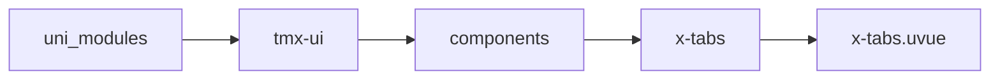
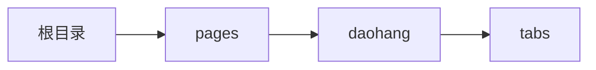

# 标签导航 xTabs
-------
<ViewMobile url="/pages/daohang/tabs" />

## 介绍

标签导航，常用于页面顶部导航时使用，角标，数字角标功能。如果使用了活动文字大小与未选中不一样的大小，那么要设定itemwidth

## 平台兼容

| Harmony | H5 | andriod | IOS | 小程序 | UTS | UNIAPP-X SDK | version |
| --- | --- | --- | --- | --- | --- | --- | --- |
| ☑ | ☑ | ☑️ | ☑️ | ☑️ | ☑️ | 4.76+ | 1.1.18 |


## 文件路径

``` ts

@/uni_modules/tmx-ui/components/x-tabs/x-tabs.uvue
```



## 使用

``` ts

<x-tabs></x-tabs>
```

## Props 属性

| 名称 | 说明 | 类型 | 默认值 |
| ------ | ---- | ---- | ---- |
| round | `圆角`<br> | `string` | `"0"` |
| width | `宽`<br> | `string` | `"auto"` |
| lineWidth | `指示线条的宽，单位为px，注意不是rpx单位的数字。`<br> | `number` | `18` |
| height | `高是必填，不可为auto。`<br> | `string` | `"44"` |
| color | `背景`<br> | `string` | `"white"` |
| darkColor | `暗黑时的背景,如果不填写读取sheetDark`<br> | `string` | `""` |
| activeTitleColor | `文本激活时的颜色 ，空值默认取全局主题色`<br> | `string` | `""` |
| titleColor | `文本默认颜色`<br> | `string` | `"#888888"` |
| darkTitleColor | `文本默认的暗黑颜色，如果不填写取白色。`<br> | `string` | `"#cacaca"` |
| lineColor | `底部线条激活时的颜色，空值默认取全局主题色`<br> | `string` | `""` |
| lineGradient | `渐变背景`<br>`数组格式如下`<br>`[方向:top,bottom,left,right,自定义值例:45deg,颜色1:,颜色2]`<br>`例:['left','black','white']`<br>`如提供，暗黑及主题失效。`<br> | `Array` | `():string[] => [] as string[]` |
| lineHeight | `行高`<br> | `string` | `"2px"` |
| lineFull | `底部的线条是与项目等宽还是固定默认的小宽度。`<br> | `boolean` | `false` |
| showLine | `是否显示底部的线条`<br> | `boolean` | `true` |
| list | ``<br> | `Array` | `():TABS_ITEM_INFO[] => [] as TABS_ITEM_INFO[]` |
| modelValue | `id值，如果数据没有提供id属性`<br>`等同v-model`<br> | `union` | `"0"` |
| fontSize | `标题字号`<br> | `string` | `"16"` |
| activeFontSize | `激活时的标题字号`<br> | `string` | `"16"` |
| itemWidth | `项目宽度，默认是auto，即自动根据标题内容自动撑开宽度。`<br>`如果你想均分（适合不超过一行），比如你有5个标签，那么你就可以设置为"20%"`<br> | `string` | `"auto"` |
| titlePadding | `标题的padding是左右的间隙。`<br> | `string` | `"12px"` |
| isItemCenter | `是否让内容居中显示,`<br>`默认为false,如果你开启了项目超过了宽出现滚动时,会自动向左对齐以便`<br>`让内容能滚动,但如果内容少于可滚动,内容会自动居中.`<br> | `boolean` | `false` |
| itemActiveStyle | `激活时的项目自定样式`<br> | `string` | `""` |
| itemStyle | `未激活时的项目自定样式`<br> | `string` | `""` |
| textActiveStyle | `激活时文本样式`<br> | `string` | `""` |
| textStyle | `未激活时的文本样式`<br> | `string` | `""` |


## Events 事件

| 名称 | 参数 | 说明 |
| ------ | ---- | ---- |
| change | `item: TABS_ITEMindex: union` | 单元格被点击 |
| update:modelValue | `-` | - |


## Slots 插槽

| 名称 | 说明 | 数据 |
| ------ | ---- | ---- |
| default | `tabs循环节点插槽,插件名称是tabs_+item.id,使用时请务必通过` | - |


## Ref 方法

| 名称 | 参数 | 返回值 | 说明 |
| ------ | ---- | ---- | ---- |


## 示例文件路径

``` json

/pages/daohang/tabs
```



## 示例源码

::: details uvue

<<< ../../../../pages/daohang/tabs.uvue{vue}

:::

