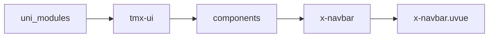
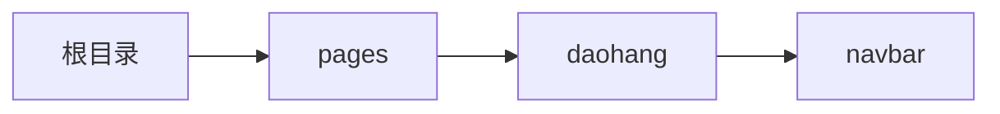

# 标题导航 xNavbar
-------
<ViewMobile url="/pages/daohang/navbar" />

## 介绍

标题导航,用途页面头部标题。可以默认透明，滚动实现背景可变的标题导航。

## 平台兼容

| Harmony | H5 | andriod | IOS | 小程序 | UTS | UNIAPP-X SDK | version |
| --- | --- | --- | --- | --- | --- | --- | --- |
| ☑ | ☑ | ☑️ | ☑️ | ☑️ | ☑️ | 4.76+ | 1.1.18 |


## 文件路径

``` ts

@/uni_modules/tmx-ui/components/x-navbar/x-navbar.uvue
```



## 使用

``` ts

<x-navbar></x-navbar>
```

## Props 属性

| 名称 | 说明 | 类型 | 默认值 |
| ------ | ---- | ---- | ---- |
| isPlace | `是否底部占位内容，如果为false底部悬空。你的页面内容将自动压在导航栏的底部。`<br> | `boolean` | `true` |
| bgColor | `背景颜色，注意这是静态时的背景色。`<br> | `string` | `'white'` |
| darkBgColor | `暗黑的背景颜色。`<br> | `string` | `"#000000"` |
| activeBgColor | `背景颜色，这是滑动时超过指定本状态栏高度时自动渐变到此颜色`<br>`如果为空时，不会有动态背景`<br>`如果提供的是白或者黑，暗黑时自动取反。`<br> | `string` | `''` |
| backColor | `返回按钮的颜色.默认是取titleColor，如果你单独定义了`<br>`以你定义的为准`<br> | `string` | `''` |
| title | `标题`<br> | `string` | `'标题'` |
| titleColor | `默认标题颜色，暗黑是取白，如果有其它需求建议插槽。`<br> | `string` | `'#333333'` |
| titleActiveColor | `动态悬浮时标题颜色,如果为暗黑时，你提供的颜色为白或者黑会反色`<br>`如果提供的是彩色自动加深或者提亮`<br> | `string` | `'#333333'` |
| titleFontSize | `标题文字大小`<br> | `string` | `'17'` |
| lrWidth | `右边的宽度。`<br> | `string` | `'100'` |
| llWidth | `左边的宽度。`<br> | `string` | `'100'` |
| zIndex | `层级。`<br> | `number` | `90` |
| backErrorPath | `左边按钮默认点击返回上页。`<br>`但如果上页返回失败（通常见于直接程序启动本面，无法进行上页返回时）`<br>`失败后返回的页面。默认是首页。`<br> | `string` | `'/pages/index/index'` |
| showNavBack | `是否显示返回按钮。`<br> | `boolean` | `true` |
| linearGradient | `渐变背景，如果提供，上面的BgColor背景和暗黑背景将失效。`<br>`例：['to right','#ff667f','#ff5416']`<br> | `string[]` | `() : string[] => [] as string[]` |
| linearActiveGradient | `动态悬浮时的渐变背景，`<br>`提供后上面的 activeBgColor的背景和暗黑背景将失效。`<br>`例：['to right','#ff667f','#ff5416']`<br> | `string[]` | `() : string[] => [] as string[]` |
| staticTransparent | `静态在顶部时是否透明背景`<br> | `boolean` | `false` |
| maxWidth | `某些时候你可能需要设定最大宽`<br>`任意单位;设置为none时表示不设置.`<br>`仅web生效`<br> | `string` | `'none'` |
| height | `这个高不是最终高,它只是导航高`<br>`状态栏高是自动的不包含在这里面.`<br>`单位为像素单位,不是rpx`<br> | `number` | `50` |


## Events 事件

| 名称 | 参数 | 说明 |
| ------ | ---- | ---- |
| fiexdChange | `-` | 当滚动页面时，导航栏位置<br>与滚动之间的距离差比（0~1）<br>0表示在顶部，1表示已经超过了导航高<br>主要是用来类型滚动时设置导航顶部的一些布局变化。 |
| init | `height: number` | 初始化完成向下发送一个事件用于告知本组件实际的高 |


## Slots 插槽

| 名称 | 说明 | 数据 |
| ------ | ---- | ---- |
| left | `左边插槽` | isFiexd: boolean<br> |
| title | `标题插槽` | isFiexd: boolean<br> |
| right | `右边插槽` | isFiexd: boolean<br> |


## Ref 方法

| 名称 | 参数 | 返回值 | 说明 |
| ------ | ---- | ---- | ---- |


## 示例文件路径

``` json

/pages/daohang/navbar
```



## 示例源码

::: details uvue

<<< ../../../../pages/daohang/navbar.uvue{vue}

:::

