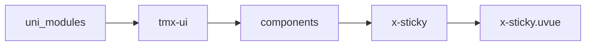
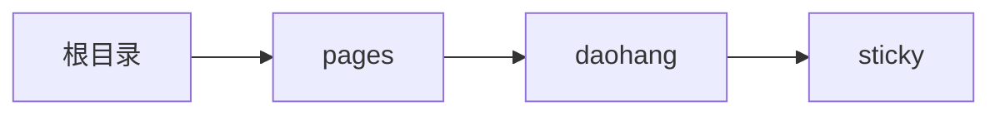

# 粘性布局 Sticky
-------
<ViewMobile url="/pages/daohang/sticky" />

## 介绍

可以同时存在多个悬停，多个悬停时，还支持触发距离悬停的设置，
在复杂页面需要多个菜单吸附时非常有用。并且配合切换change事件做到更复杂的布局。

## 平台兼容

| Harmony | H5 | andriod | IOS | 小程序 | UTS | UNIAPP-X SDK | version |
| --- | --- | --- | --- | --- | --- | --- | --- |
| ☑ | ☑ | ☑️ | ☑️ | ☑️ | ☑️ | 4.76+ | 1.1.18 |


## 文件路径

``` ts

@/uni_modules/tmx-ui/components/x-sticky/x-sticky.uvue
```



## 使用

``` ts

<x-sticky></x-sticky>
```

## Props 属性

| 名称 | 说明 | 类型 | 默认值 |
| ------ | ---- | ---- | ---- |
| top | `顶部的偏移量`<br> | `string` | `"0"` |
| left | `左边的偏移量。`<br> | `string` | `"0"` |
| diffTop | `触发距离，默认0，意思是组件距离顶部多远时触发悬停。`<br>`对于需要多个悬停时此属性非常有用。`<br>`这个值不允许使用%单位，可以是：px,rpx,数字（默认是rpx）`<br> | `string` | `'0'` |
| zIndex | `层级`<br> | `number` | `88` |


## Events 事件

| 名称 | 参数 | 说明 |
| ------ | ---- | ---- |
| change | `undefinedisFixed: boolean` | 当触发悬停切换时触发 |


## Slots 插槽

| 名称 | 说明 | 数据 |
| ------ | ---- | ---- |
| default | `默认插槽，你要悬停的布局放在这里。` | status: boolean<br> |


## Ref 方法

| 名称 | 参数 | 返回值 | 说明 |
| ------ | ---- | ---- | ---- |


## 示例文件路径

``` json

/pages/daohang/sticky
```



## 示例源码

::: details uvue

<<< ../../../../pages/daohang/sticky.uvue{vue}

:::

