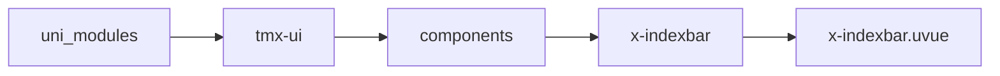
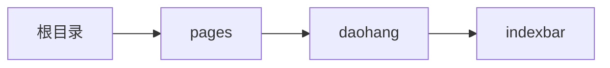

# 索引 xIndexbar
-------
<ViewMobile url="/pages/daohang/indexbar" />

## 介绍

特别提醒：本组件在1.0.9重构不向下兼容，并且删除了子组件：x-indexbar-item，不再需要子组件。请使用对应的动态插槽来渲染
数据，demo是526条数据的测试依赖右边索引滑动跟手流畅。
虚拟列表有个缺点会在滚动时分页读取数据并复用布局，因此如果你想做带图片的索引，
建议进入应用后启用后台缓存已有的头像或者图片数据类似微信那样缓存图片，这样虚拟加载的时候闪烁感就少了
重要：插槽内不要使用任何自定组件布局，也不要增加任何额外的节点，能少就少。

## 平台兼容

| Harmony | H5 | andriod | IOS | 小程序 | UTS | UNIAPP-X SDK | version |
| --- | --- | --- | --- | --- | --- | --- | --- |
| ☑ | ☑ | ☑️ | ☑️ | ☑️ | ☑️ | 4.76+ | 1.1.18 |


## 文件路径

``` ts

@/uni_modules/tmx-ui/components/x-indexbar/x-indexbar.uvue
```



## 使用

``` ts

<x-indexbar></x-indexbar>
```

## Props 属性

| 名称 | 说明 | 类型 | 默认值 |
| ------ | ---- | ---- | ---- |
| width | `宽`<br> | `string` | `"auto"` |
| height | `高，%,rpx,px单位均可。`<br> | `string` | `"100%"` |
| dotActiveColor | `侧边指示激活时的文字颜色`<br>`空值是取全局主题值`<br> | `string` | `""` |
| dotColor | `侧边指示未激活时的文字颜色`<br> | `string` | `"#c0c0c0"` |
| dotBgColor | `侧边指示的背景颜色`<br> | `string` | `"white"` |
| list | ``<br> | `UTSJSONObject[]` | `() : UTSJSONObject[] => [] as UTSJSONObject[]` |
| cellHeight | `项目的高`<br>`只能是数字，或者带rpx,px单位`<br> | `string` | `'50'` |
| titleHeight | `项目的标题高`<br>`只能是数字，或者带rpx,px单位`<br> | `string` | `'32'` |
| customSliderBar | ``<br> | `Array<string>` | `():string[] => [] as string[]` |


## Events 事件

| 名称 | 参数 | 说明 |
| ------ | ---- | ---- |


## Slots 插槽

| 名称 | 说明 | 数据 |
| ------ | ---- | ---- |
| header | `悬浮的菜单头` | - |
| top | `顶部布局，可以自由布局` | - |
| default | `动态插槽` | index: UTSJSONObject<br>index: number<br>index: number<br>currentIndex: UTSJSONObject<br>currentIndex: number<br>currentIndex: number<br>current: UTSJSONObject<br>current: number<br>current: number<br> |


## Ref 方法

| 名称 | 参数 | 返回值 | 说明 |
| ------ | ---- | ---- | ---- |


## 示例文件路径

``` json

/pages/daohang/indexbar
```



## 示例源码

::: details uvue

<<< ../../../../pages/daohang/indexbar.uvue{vue}

:::

