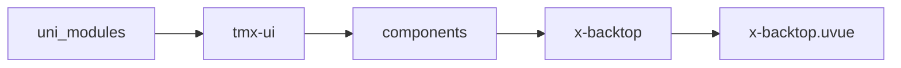
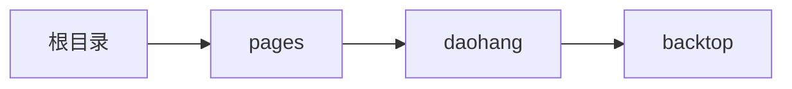

# 返回顶部 xBacktop
-------
<ViewMobile url="/pages/daohang/backtop" />

## 介绍

在uvue页面中，根节点一定是scroll-view并且设置为flex:1才可滚动到顶部。
如果你想局部放到scroll-view组件中，你需要scroll事件中的top传递到属性scrollTop上并启用局部滚动置顶
如果你想改变或者自定位置，你可以直接在组件上写style来覆盖定位。详见：https://doc.dcloud.net.cn/uni-app-x/api/page-scroll-to.html

## 平台兼容

| Harmony | H5 | andriod | IOS | 小程序 | UTS | UNIAPP-X SDK | version |
| --- | --- | --- | --- | --- | --- | --- | --- |
| ☑ | ☑ | ☑️ | ☑️ | ☑️ | ☑️ | 4.76+ | 1.1.18 |


## 文件路径

``` ts

@/uni_modules/tmx-ui/components/x-backtop/x-backtop.uvue
```



## 使用

``` ts

<x-backtop></x-backtop>
```

## Props 属性

| 名称 | 说明 | 类型 | 默认值 |
| ------ | ---- | ---- | ---- |
| round | `圆角,空值时取全局的drawr圆角。`<br> | `string` | `"50px"` |
| offset | `向下滚动页面时，如果超过此值显示返回顶部按钮。`<br> | `number` | `100` |
| bgColor | `背景,支持渐变值如:linear-gradient(to left, #FFED46, #FF7EC7)`<br>`默认空值，取全局主题值。`<br> | `string` | `""` |
| width | `宽度`<br> | `string` | `"50px"` |
| height | `高度`<br> | `string` | `"50px"` |
| color | `图标颜色。`<br> | `string` | `"white"` |
| icon | `图标`<br> | `string` | `"skip-up-fill"` |
| iconSize | `图标大小`<br> | `string` | `"30"` |
| scrollTop | `如果你想让本组件放置到局部的scroll中时，你外部scrollview通过scroll事件取得距离顶部的位置传递到此。`<br> | `number` | `0` |
| disabledPageScroll | `禁用页面级根节点滚动后，可以通过scrollTop来实现局部置顶功能。`<br> | `boolean` | `false` |


## Events 事件

| 名称 | 参数 | 说明 |
| ------ | ---- | ---- |
| click | `-` | 点击时触发 |


## Slots 插槽

| 名称 | 说明 | 数据 |
| ------ | ---- | ---- |
| default | `默认图标插槽` | - |


## Ref 方法

| 名称 | 参数 | 返回值 | 说明 |
| ------ | ---- | ---- | ---- |


## 示例文件路径

``` json

/pages/daohang/backtop
```



## 示例源码

::: details uvue

<<< ../../../../pages/daohang/backtop.uvue{vue}

:::

