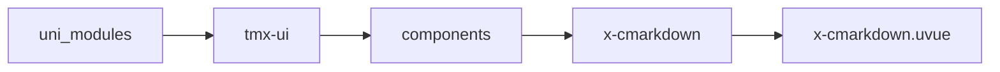

# markdown xCmarkdown
-------
<ViewMobile url="/pages/zhanshi/cmarkdown" />

## 介绍

markdown组件,可以用来渲染标签的html文章或者纯Markdown或者markdown+简单的html标签混合渲染，与原x-markdown不同，采用官方原生c库实现解析速度超猛。
并且是纯原生渲染，不再是webview渲染了，因此渲染速度也超快。并且为了兼容和生成截图的需求，针对官方C库解析扩展了相关的功能
1、允许你在markdown中输入简单的html标签，以控制一些文本样式：比如颜色，背景字号等行内样式。2、允许启用isHtml纯html解析，当你启用html解析时它的技术路径是
参考微信小程序支持的标签过滤掉不支持的标签，和删除属性，再进行原生渲染，因此理论上说纯html会比较快解析的数量要少。
[此组件依赖uni-cmark插件可在代码仓库下载]

## 平台兼容

| Harmony | H5 | andriod | IOS | 小程序 | UTS | UNIAPP-X SDK | version |
| --- | --- | --- | --- | --- | --- | --- | --- |
| ☑ | ☑ | ☑ | ☑ | ☑ | ☑ | 4.76+ | 1.1.20+ |


## 文件路径

``` ts

@/uni_modules/tmx-ui/components/x-cmarkdown/x-cmarkdown.uvue
```



## 使用

``` ts

<x-cmarkdown></x-cmarkdown>
```

## Props 属性

| 名称 | 说明 | 类型 | 默认值 |
| ------ | ---- | ---- | ---- |
| value | ``<br> | `string` | `""` |
| codeTheme | ``<br> | `union` | `'jetbrains'` |
| codeThemeMode | `代码块主题，以什么样式主题输出，auto:自动跟随全局主题，light:使用亮系配色，dark:使用暗系配色`<br> | `union` | `'auto'` |
| previewImage | `预览图片`<br> | `boolean` | `true` |
| showCodeToolbar | `是否显示代码复制工具栏`<br> | `boolean` | `true` |
| showTableRipple | `显示表格波纹背景`<br> | `boolean` | `true` |
| linkAndCopyColor | `链接及复制的主色，空取全值`<br> | `string` | `''` |
| isHtml | `是否是纯html，它会先把html内容解析为标签的Markdown格式，删除不支持的标签，删除所有属性和样式，统一样式`<br>`如果你需要指定文本颜色可以使用行内html块比如<span style="color:red;">我是内容</span>,仅支持行内样式。`<br> | `boolean` | `false` |
| fontSize | `默认的字号,它是文本字号，不包含其它特殊的文本字号，如果有标签内的样式字号此处会失效`<br> | `string` | `"16px"` |


## Events 事件

| 名称 | 参数 | 说明 |
| ------ | ---- | ---- |
| link | `val: string` | 连接被点击 |
| image | `val: string` | 图片被点击 |


## Slots 插槽

| 名称 | 说明 | 数据 |
| ------ | ---- | ---- |


## Ref 方法

| 名称 | 参数 | 返回值 | 说明 |
| ------ | ---- | ---- | ---- |


## 示例文件路径

``` json

/pages/zhanshi/cmarkdown
```


## 示例源码

::: details uvue

<<< ../../../../pages/zhanshi/cmarkdown.uvue{vue}

:::

