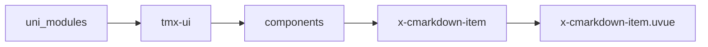
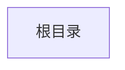

# markdown子组件 xCmarkdownItem
-------
<ViewMobile url="" />

## 介绍

x-cmarkdown的子组件，不可外部使用。[此组件依赖uni-cmark插件可在代码仓库下载]

## 平台兼容

| Harmony | H5 | andriod | IOS | 小程序 | UTS | UNIAPP-X SDK | version |
| --- | --- | --- | --- | --- | --- | --- | --- |
| x | ☑ | ☑️ | ☑️ | ☑️ | ☑️ | 4.76+ | 1.1.19 |


## 文件路径

``` ts

@/uni_modules/tmx-ui/components/x-cmarkdown-item/x-cmarkdown-item.uvue
```



## 使用

``` ts

<x-cmarkdown-item></x-cmarkdown-item>
```

## Props 属性

| 名称 | 说明 | 类型 | 默认值 |
| ------ | ---- | ---- | ---- |
| value | ``<br> | `Array` | `() : MarkdownToken[] => [] as MarkdownToken[]` |
| _class | ``<br> | `string` | `''` |
| type | ``<br> | `string` | `''` |
| href | ``<br> | `string` | `''` |
| codeTheme | ``<br> | `union` | `'jetbrains'` |
| codeThemeMode | `代码块主题，以什么样式主题输出，auto:自动跟随全局主题，light:使用亮系配色，dark:使用暗系配色`<br> | `union` | `'auto'` |
| previewImage | `预览图片`<br> | `boolean` | `true` |
| showCodeToolbar | `是否显示代码复制工具栏`<br> | `boolean` | `true` |
| showTableRipple | `显示表格波纹背景`<br> | `boolean` | `true` |
| linkAndCopyColor | `链接及复制的主色，空取全值`<br> | `string` | `''` |
| fontSize | `默认的字号,它是文本字号，不包含其它特殊的文本字号，如果有标签内的样式字号此处会失效`<br> | `string` | `"15px"` |


## Events 事件

| 名称 | 参数 | 说明 |
| ------ | ---- | ---- |
| link | `val: string` | 连接被点击 |
| image | `val: string` | 图片被点击 |


## Slots 插槽

| 名称 | 说明 | 数据 |
| ------ | ---- | ---- |


## Ref 方法

| 名称 | 参数 | 返回值 | 说明 |
| ------ | ---- | ---- | ---- |


## 示例文件路径

``` json


```



## 示例源码

::: details uvue


:::

