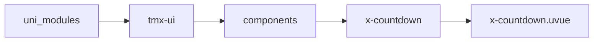
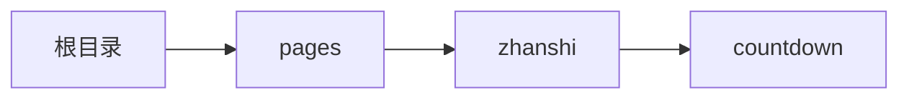

# 倒计时 xCountdown
-------
<ViewMobile url="/pages/zhanshi/countdown" />

## 介绍

倒计时，可以精确到秒，毫秒,记住

## 平台兼容

| Harmony | H5 | andriod | IOS | 小程序 | UTS | UNIAPP-X SDK | version |
| --- | --- | --- | --- | --- | --- | --- | --- |
| ☑ | ☑ | ☑️ | ☑️ | ☑️ | ☑️ | 4.76+ | 1.1.18 |


## 文件路径

``` ts

@/uni_modules/tmx-ui/components/x-countdown/x-countdown.uvue
```



## 使用

``` ts

<x-countdown></x-countdown>
```

## Props 属性

| 名称 | 说明 | 类型 | 默认值 |
| ------ | ---- | ---- | ---- |
| time | ``<br> | `number` | `0` |
| actions | `指令，可以通过变动此值来达到暂停，开始，结束的功能，当然也可以通过ref方法控制。"pause" \`<br>` "play" \`<br>` "reset" \`<br>` ""`<br> | `union` | `""` |
| format | `显示格式`<br>`DD天，HH时，MM分，SS秒，MS毫秒`<br> | `string` | `"DD天HH时MM分SS秒"` |
| autoStart | ``<br> | `boolean` | `false` |
| unit | `以秒还是毫秒为单位到计时。`<br>`ss\`<br>`ms`<br> | `union` | `"ss"` |
| fontSize | `文本大小`<br> | `string` | `"16"` |
| color | `文本颜色`<br> | `string` | `"#333333"` |
| captcha | `是否使用验证码模式`<br>`统一倒计时实例`<br> | `boolean` | `false` |


## Events 事件

| 名称 | 参数 | 说明 |
| ------ | ---- | ---- |
| change | `time: number` | 时间变化时触发 |
| pause | `-` | 暂停时触发 |
| start | `-` | 开始时触发 |
| complete | `-` | 结束时触发 |


## Slots 插槽

| 名称 | 说明 | 数据 |
| ------ | ---- | ---- |
| default | `插槽` | status: string<br>status: number<br>status: string<br>status: string<br>status: string<br>status: string<br>status: string<br>status: string<br>time: string<br>time: number<br>time: string<br>time: string<br>time: string<br>time: string<br>time: string<br>time: string<br>label: string<br>label: number<br>label: string<br>label: string<br>label: string<br>label: string<br>label: string<br>label: string<br>ms: string<br>ms: number<br>ms: string<br>ms: string<br>ms: string<br>ms: string<br>ms: string<br>ms: string<br>ss: string<br>ss: number<br>ss: string<br>ss: string<br>ss: string<br>ss: string<br>ss: string<br>ss: string<br>mm: string<br>mm: number<br>mm: string<br>mm: string<br>mm: string<br>mm: string<br>mm: string<br>mm: string<br>hh: string<br>hh: number<br>hh: string<br>hh: string<br>hh: string<br>hh: string<br>hh: string<br>hh: string<br>dd: string<br>dd: number<br>dd: string<br>dd: string<br>dd: string<br>dd: string<br>dd: string<br>dd: string<br> |


## Ref 方法

| 名称 | 参数 | 返回值 | 说明 |
| ------ | ---- | ---- | ---- |
| start | - | `-` | 开始 |
| pause | - | `-` | 暂停 |
| reset | - | `-` | 重置 |
| getStatus | - | `-` | 获取当前运行状态，返回值是："initial" \| "running" \| "paused" \| "finished" |


## 示例文件路径

``` json

/pages/zhanshi/countdown
```



## 示例源码

::: details uvue

<<< ../../../../pages/zhanshi/countdown.uvue{vue}

:::

