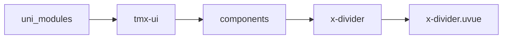
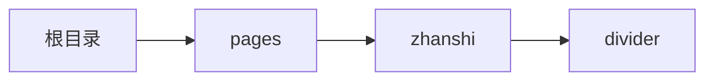

# 分割线 xDivider
-------
<ViewMobile url="/pages/zhanshi/divider" />

## 介绍

横和竖向，内容左，中，右。

## 平台兼容

| Harmony | H5 | andriod | IOS | 小程序 | UTS | UNIAPP-X SDK | version |
| --- | --- | --- | --- | --- | --- | --- | --- |
| ☑ | ☑ | ☑️ | ☑️ | ☑️ | ☑️ | 4.76+ | 1.1.18 |


## 文件路径

``` ts

@/uni_modules/tmx-ui/components/x-divider/x-divider.uvue
```



## 使用

``` ts

<x-divider></x-divider>
```

## Props 属性

| 名称 | 说明 | 类型 | 默认值 |
| ------ | ---- | ---- | ---- |
| align | `对齐方式`<br> | `alignType` | `"center"` |
| label | `文本`<br> | `string` | `""` |
| color | `线的颜色`<br> | `string` | `"#e5e5e5"` |
| darkColor | `线的暗黑颜色，如果不提供取全局的borderDarkColor`<br> | `string` | `""` |
| lineWidth | `线粗细度。`<br> | `string` | `"1"` |
| height | `竖向时的高度`<br> | `string` | `"10"` |
| labelColor | `文本颜色`<br> | `string` | `"#a2a2a2"` |
| model | `线条样式`<br> | `modelType` | `"solid"` |
| fontSize | `字体大小`<br> | `string` | `"11"` |
| vertical | `是否是竖向`<br> | `boolean` | `false` |


## Events 事件

| 名称 | 参数 | 说明 |
| ------ | ---- | ---- |


## Slots 插槽

| 名称 | 说明 | 数据 |
| ------ | ---- | ---- |
| default | `默认文本插槽。建议通过属性label填写，如果你有特殊要求可以` | - |


## Ref 方法

| 名称 | 参数 | 返回值 | 说明 |
| ------ | ---- | ---- | ---- |


## 示例文件路径

``` json

/pages/zhanshi/divider
```



## 示例源码

::: details uvue

<<< ../../../../pages/zhanshi/divider.uvue{vue}

:::

